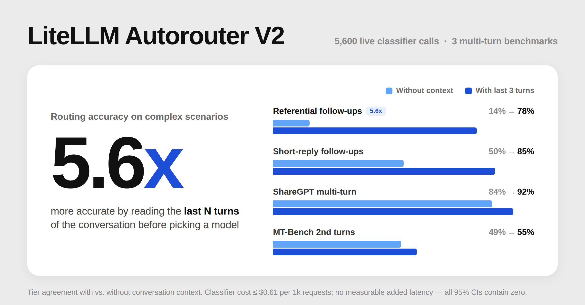
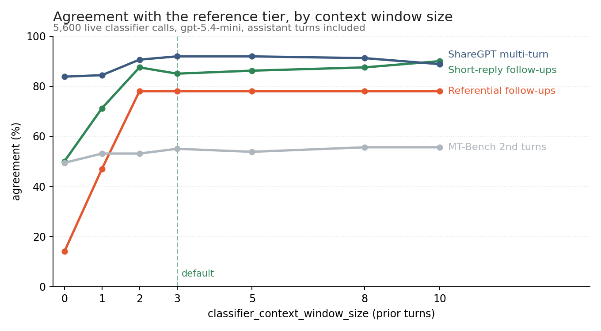

<br /><br />

:::info[🚀 Help shape the Auto-Router]

Get early access, work directly with the LiteLLM team, and influence the roadmap with your production traffic.

<a className="button button--primary button--lg" style={{background: '#2e8555', borderColor: '#2e8555', color: '#fff'}} href="https://calendar.app.google/i2e7qVEJphHi5S8UA">Apply to Become a Design Partner</a>

<br /><br />

Already testing it? Share your results in [discussion #32168](https://github.com/BerriAI/litellm/discussions/32168).

:::

v1.97 makes three changes to the auto router.

* The LLM classifier now receives a window of prior conversation turns, defaulting to three. This improves accuracy of follow-up classifications from 14% to 78%, costs at most $0.61 per 1,000 requests, and no additional latency.
* A new Benchmarks view prices routed traffic against an all-frontier baseline and reports the difference, and those savings now also appear in the Cost Optimization totals.
* Session affinity is now off by default, following our [previous post](/blog/auto-router-prompt-caching-benchmark) showing this was leading to worse quality without cost improvements.

:::warning Two defaults changed

`classifier_context_window_size` now defaults to `3` (LLM classifier only), and `session_affinity` now defaults to `false` (all routers). Config files are not modified, but the new defaults apply to any key left unset, so a config that never mentioned `session_affinity` will reclassify every turn after upgrading. Configs that set either key explicitly are unaffected.

:::

{/* truncate */}

## Cost and usage benchmarks

The Benchmarks view shows your savings using your router against a fixed model (Opus, for example) on your actual usage.


Per router and per time range, it prices routed traffic against the same traffic sent to one frontier model at list prices and reports the difference in dollars and percent, alongside: sessions on the router, turns per session, tokens per session, and savings per session. The baseline is priced with a warm single-model cache rather than a cold one.

The view also estimates the value of a background cache warmer on your traffic, netting rescued cache writes against the cost of the replays. The Benchmarks numbers are queryable directly:

```bash
GET /auto_router/benchmarks?start_date=2026-07-01&end_date=2026-07-31
```

### Savings roll up into Cost Optimization

Router savings now feed into the Cost Optimization section alongside prompt compression and prompt caching, with their own card, savings line, and slice of the by-driver breakdown.


The two views answer different questions and their savings figures will not match. Benchmarks prices traffic against one frontier model end to end; the Cost Optimization card counts the difference between the tier the router picked and the priciest tier it could have picked.

## The LLM classifier can see prior turns

:::note

Everything in this section requires `classifier_type: llm`. The heuristic scorer does not call a model and has nowhere to put the context, so it is unchanged; the three fields below are read only on the LLM path.

:::

### The problem

The LLM classifier previously only saw the current turn, which does not work well for multi-turn queries:

* Turn 1: "Make a plan to redesign this component"
* Turn 2: "Yes, go ahead"

Turn 2 may be classified as simple while the work it authorises is substantial.

Three new fields on `complexity_router_config` address this:

```yaml
    litellm_params:
      model: auto_router/complexity_router
      complexity_router_config:
        classifier_type: llm
        classifier_llm_config:
          model: gpt-5.4-mini
        classifier_context_window_size: 3                  # default 3; 0 = old behavior
        classifier_context_per_turn_chars: 200             # default 200
        classifier_context_include_assistant_turns: false  # default false
```

Prior turns are inserted oldest-first, numbered `[1]`, `[2]`, `[3]`, each clipped to `classifier_context_per_turn_chars` with a trailing ellipsis marking the cut.

Turns without human-written text do not consume a slot. Tool output is excluded, `<system-reminder>` blocks are stripped, turns left empty after stripping are skipped, and a turn identical to the ask being classified is dropped.

With `classifier_context_include_assistant_turns` enabled, assistant messages join the window with role labels, and that text reaches the classifier payload only; keyword rules, escalation, the heuristic scorer, and semantic matching continue to read the human message alone.

### What we measured

5,600 live classifier calls against real providers: two sweeps of seven configurations each (`classifier_context_window_size` of 0, 1, 2, 3, 5, 8, 10), one with assistant turns in the window and one without, across three multi-turn datasets, with two repeats per conversation. Everything else was identical between configurations, including the conversations, the rubric, the classifier model (`gpt-5.4-mini`), and the per-turn cap.

**Quality.** Agreement between the tier the router picked and the reference tier:

| Window | Short-reply follow-ups | MT-Bench 2nd turns | ShareGPT multi-turn |
|---|---|---|---|
| 0 | 50.0% | 49.4% | 83.8% |
| 1 | 71.2% | 53.1% | 84.4% |
| 2 | 87.5% | 53.1% | 90.6% |
| **3** *(default)* | **85.0%** | **55.0%** | **91.9%** |
| 5 | 86.2% | 53.8% | 91.9% |
| 8 | 87.5% | 55.6% | 91.2% |
| 10 | 90.0% | 55.6% | 88.8% |

The largest effect is on the 36 follow-ups whose final turn only resolves against the history. Agreement there is **14% at N=0, 47% at N=1, and 78% at N=2**, and flat from there out to N=10. Self-describing controls in the same set sit at 80% with no window and 91 to 95% with one, so the window is not raising every number uniformly.

N=1 recovers less than half the gap. One prior turn tells the classifier that a conversation exists without establishing its subject, and roughly a third of referential cases remain misrouted at that setting.

MT-Bench's ceiling reflects its reference labels rather than router behaviour. Its category-to-tier mapping assigns MEDIUM to every "writing" second turn, so that column is usable as a trend and not as an accuracy score.



**Latency.** Paired per conversation against N=0, every 95% bootstrap CI contains **zero** in both sweeps:

| Window | Assistant turns on | Assistant turns off |
|---|---|---|
| 1 | +21.5 ms [-19.6, +63.9] | -17.8 ms [-68.9, +29.6] |
| 2 | +10.5 ms [-31.2, +55.2] | -14.3 ms [-67.2, +34.4] |
| 3 | +6.2 ms [-30.0, +43.0] | -10.8 ms [-61.1, +37.1] |
| 5 | +6.0 ms [-37.5, +52.6] | +11.7 ms [-40.6, +61.9] |
| 8 | -10.5 ms [-45.0, +23.9] | +10.2 ms [-43.6, +63.9] |
| 10 | +9.0 ms [-25.9, +43.1] | -15.3 ms [-65.6, +30.0] |

Prompt tokens and latency correlate at r = 0.007 with assistant turns on and r = 0.018 with them off, across a 318 to 1,043 token range. The window adds prefill only; output remains a small fixed structured tier. p50 sits near 600 ms in every configuration.

**Cost.** The classifier costs at most $0.61 per 1,000 requests:

| Window | Classifier $/1k req (follow-ups / MT-Bench / ShareGPT) | Modelled routed $/1k req |
|---|---|---|
| 0 | $0.31 / $0.32 / $0.34 | $2.87 / $5.41 / $5.48 |
| 2 | $0.38 / $0.42 / $0.44 | $6.79 / $4.65 / $5.31 |
| 3 | $0.38 / $0.42 / $0.47 | $6.49 / $5.13 / $5.14 |
| 10 | $0.38 / $0.42 / $0.61 | $6.42 / $4.87 / $5.22 |

Tier selection dominates the cost effect, and it moves in both directions depending on the traffic.

On the short-reply set, routed cost rises from $2.87 to about $6.50 per 1k. At N=0 those requests went to the cheap tier while authorising substantial work, with a tier mix of 66% SIMPLE at N=0 against 30% at N=2, so the increase reflects requests being priced at the tier they required. On MT-Bench and ShareGPT routed cost drifts down instead, as context resolves ambiguous follow-ups to MEDIUM rather than REASONING.

Which direction applies to a given deployment depends on its traffic, which is what the Benchmarks view is for: compare routed spend against the baseline after a day of traffic.

### What to run

The default of 3 sits past the point where every curve flattens, and additional classifier tokens beyond it produce no measurable gain. The tables above come from the assistant-turns-on sweep; the user-only sweep, which is the default, plateaus one slot earlier because an assistant turn otherwise consumes a slot, so 3 is sufficient in both modes.

`classifier_context_include_assistant_turns` ships off because enabling it shifts tier decisions, and therefore spend, on routers already in production.

`classifier_context_per_turn_chars` is best left at 200. The plateau arrives well before the cap takes effect, and the truncation marker is sufficient signal that a turn was cut.

<details>
<summary>Caveats</summary>

Reference tiers are judgement calls. The hand labels and the ShareGPT judge pass both encode the rule that a short reply inherits the difficulty of the work it approves, which is the behaviour the window produces, making the follow-up set both the sharpest instrument here and the most favourable one.

Routed completion cost is modelled rather than billed: the chosen tier's price applied to the conversation's prompt tokens plus 600 output tokens. No tier model was called, which isolates the effect of the tier choice from the effect of any particular answer.

One classifier model was swept. A reasoning-heavier model carries more absolute latency, though the marginal cost of roughly 200 extra prefill tokens should remain negligible.

Latency was measured on a single VM at concurrency 10. The paired differences carry the finding; the absolute numbers reflect that setup.

</details>

## Session affinity now off by default

Session affinity pins a session to the model that handled its first turn and skips reclassification thereafter, with the goal of keeping provider prompt caches warm. Two things motivated the change of default.

Our [prompt caching benchmark](/blog/auto-router-prompt-caching-benchmark) examined 4,684 switch-backs and found 97.4% still warm at the 5-minute TTL and 99.3% at an hour. Provider caches survive routing changes well enough that pinning was trading routing quality for cache hits that would have occurred anyway.

Additionally, pinning served in part as a substitute for a classifier without access to conversation history, which is no longer needed.

Configs that do not mention `session_affinity` will classify every turn after upgrading. To retain the previous behaviour, for strict per-session model consistency or for prefixes long enough that a miss is expensive, set it explicitly:

```yaml
      complexity_router_config:
        session_affinity: true
        session_affinity_ttl_seconds: 3600
```

Affinity requires a resolvable `session_id` in metadata and is ignored when `plugins` are set.

## Try it

```yaml
model_list:
  - model_name: gpt-5.4-nano
    litellm_params: {model: openai/gpt-5.4-nano}
  - model_name: gpt-5.4-mini
    litellm_params: {model: openai/gpt-5.4-mini}
  - model_name: claude-sonnet-5
    litellm_params: {model: anthropic/claude-sonnet-5}
  - model_name: gpt-5.5
    litellm_params: {model: openai/gpt-5.5}

  - model_name: smart-router
    litellm_params:
      model: auto_router/complexity_router
      complexity_router_default_model: claude-sonnet-5
      complexity_router_config:
        classifier_type: llm
        classifier_llm_config:
          model: gpt-5.4-mini
          timeout_ms: 2000
        classifier_context_window_size: 3
        classifier_context_per_turn_chars: 200
        tiers:
          SIMPLE: gpt-5.4-nano
          MEDIUM: gpt-5.4-mini
          COMPLEX: claude-sonnet-5
          REASONING: gpt-5.5
```

Every response carries `x-litellm-model-name` and `x-litellm-response-cost`, so the tier for a given request can be checked before relying on any aggregate. After a day of production traffic, the routed-versus-baseline figure in Benchmarks describes a specific workload more accurately than any of the datasets used here.

Full docs: [Auto Routing](https://docs.litellm.ai/docs/proxy/auto_routing).
