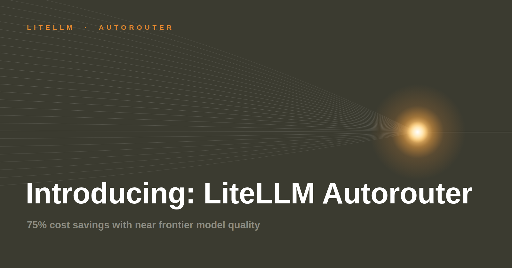

Auto routing promises a smaller bill without a worse answer. We measured both halves against a baseline that sends every request to `claude-opus-5`: 8,619 graded prompts and cost simulations over 14,000 real conversations.

{/* truncate */}

:::info[🚀 Help shape the Auto-Router]

Get early access, work directly with the LiteLLM team, and influence the roadmap with your production traffic.

<a className="button button--primary button--lg" style={{background: '#2e8555', borderColor: '#2e8555', color: '#fff'}} href="https://calendar.app.google/i2e7qVEJphHi5S8UA">Apply to Become a Design Partner</a>

<br /><br />

Already testing it? Share your results in [discussion #32172](https://github.com/BerriAI/litellm/discussions/32172).

:::

## The results

- **40.4% cheaper at 97.1% of frontier quality**, on 220 prompts from six public benchmarks replayed through a live proxy
- **74.5% cheaper at 87.3% of frontier quality**, on RouterArena's full 8,399-query set
- **Around 65% cheaper** on simulated real chat and developer traffic, where most requests are short

| Evaluation | Sample | Quality retained vs Opus-5 | Cost savings vs Opus-5 | Routing mix (haiku/sonnet/opus) |
| --- | --- | --- | --- | --- |
| Live proxy, six public benchmarks | 220 prompts | **97.1%** (Auto Router 91.8% pass, Opus-5 94.5%) | **40.4%** (Auto Router $10.47 / 1k, Opus-5 $17.57) | 27% / 70% / 3% |
| [RouterArena](https://github.com/RouteWorks/RouterArena) full set, paired | 8,399 prompts | **87.3%** (Auto Router 68.6% accuracy, Opus-5 78.5%) | **74.5%** (Auto Router $2.15 / 1k, Opus-5 $8.45) | 79% / 17% / 4% |
| Simulation, general consumer chat ([WildChat-1M](https://huggingface.co/datasets/allenai/WildChat-1M)) | 12,000 conversations | not measured | **64.9%** | 76% / 14% / 10% |
| Simulation, developer chat ([DevGPT](https://github.com/NAIST-SE/DevGPT)) | 2,056 conversations | not measured | **65.4%** | 48% / 27% / 25% |
| Simulation, code-in-prompt heavy ([WildChat](https://huggingface.co/datasets/allenai/WildChat-1M) code-filtered) | 993 conversations | not measured | **20.0%** | 13% / 34% / 53% |

## How it was measured

- **Router arm:** one model group, four tiers. SIMPLE to `claude-haiku-4-5`, MEDIUM to `claude-sonnet-5`, COMPLEX and REASONING both to `claude-opus-5`, since Opus 5 already thinks by default. Heuristic classifier, no keyword rules, no adaptive sampling
- **Baseline arm:** the same prompts sent straight to `claude-opus-5`, which is what most teams do today when they point a workload at one frontier model
- **Cost savings:** what the router spent against what the baseline spent. On the live proxy, LiteLLM reports the cost of every request back in a response header; on the other legs we price the tokens each request actually used
- **Quality retained:** the router's pass rate against the baseline's, evaluating identical prompts with the same grader on both arms

What counts as a pass:

| Dataset | How a pass is decided |
| --- | --- |
| [HumanEval](https://huggingface.co/datasets/openai/openai_humaneval), [MBPP](https://huggingface.co/datasets/google-research-datasets/mbpp) | the datasets' own unit tests run in a subprocess; pass only if every official assert passes |
| [GSM8K](https://huggingface.co/datasets/openai/gsm8k), [MATH-500](https://huggingface.co/datasets/HuggingFaceH4/MATH-500), [MMLU-Pro](https://huggingface.co/datasets/TIGER-Lab/MMLU-Pro) | answer-key match: the extracted final number, LaTeX normalisation with a SymPy equivalence fallback, and the final answer letter |
| [SWE-bench Lite](https://huggingface.co/datasets/princeton-nlp/SWE-bench_Lite) | LLM as judge, comparing the named files, functions, and diff sketch against the patch upstream actually merged |
| [RouterArena](https://github.com/RouteWorks/RouterArena) | RouterArena's own evaluator; about 74% of queries are multiple choice matched on a `\boxed{X}` letter, the rest use per-dataset scorers |

:::note

SWE-bench Lite is the only slice scored by LLM as judge; everything else is checked against the dataset's own answer key or test suite. Every SWE-bench answer was judged twice, by `claude-opus-5` and by `gemini-3.6-flash`, and retention holds at 96.6% under the stricter judge.

:::

## Where the savings come from, and what they cost

| Dataset | Auto Router pass | Opus-5 pass | Auto Router $/1k | Opus-5 $/1k | Savings |
| --- | --- | --- | --- | --- | --- |
| [GSM8K](https://huggingface.co/datasets/openai/gsm8k) | 98% (39/40) | 98% (39/40) | 1.08 | 5.68 | 81% |
| [HumanEval](https://huggingface.co/datasets/openai/openai_humaneval) | 100% (40/40) | 98% (39/40) | 2.85 | 8.16 | 65% |
| [MMLU-Pro](https://huggingface.co/datasets/TIGER-Lab/MMLU-Pro) | 85% (34/40) | 88% (35/40) | 4.21 | 11.70 | 64% |
| [MATH-500](https://huggingface.co/datasets/HuggingFaceH4/MATH-500) | 90% (36/40) | 98% (39/40) | 5.70 | 13.16 | 57% |
| [MBPP](https://huggingface.co/datasets/google-research-datasets/mbpp) | 95% (38/40) | 98% (39/40) | 2.20 | 5.01 | 56% |
| [SWE-bench Lite](https://huggingface.co/datasets/princeton-nlp/SWE-bench_Lite) | 75% (15/20) | 85% (17/20) | 83.08 | 105.83 | 21% |
| **Blended** | **91.8%** | **94.5%** | **10.47** | **17.57** | **40%** |

The split runs opposite to intuition:

- **Short, cheap traffic saves the most at no quality cost.** GSM8K is identical at a fifth of the price, and HumanEval came out one prompt ahead of the frontier baseline
- **Repo-level work saves the least.** Those prompts are long enough to dominate absolute spend, and the classifier correctly declines to send them to Haiku
- **Quality is given up in two places.** MATH-500, where Haiku took 19 of the 40 prompts and the arm finished three behind, and SWE-bench Lite

## Auto-routing and prompt caching

A question we keep hearing: do I have to choose between auto-routing and prompt caching?

No. Session affinity already lets you keep a conversation on the model its first turn picked, so the cache holds for the rest of that conversation. What it costs you is the routing decision on every turn after the first: once a session is pinned, a one-line follow-up stays on whatever model the opening turn earned. Closing that gap is the first item below.

## What's next

- **Prompt caching that survives a tier change.** Affinity pins a conversation today because switching models means a cold cache. We are testing a background refresher that keeps the prefix warm on every tier, so a session can move without paying the write cost twice
- **Routing decisions you can inspect.** Surfacing why a request landed on the tier it did, not just which model served it. That same signal feeds back into the classifier, so it improves against real traffic rather than benchmarks

## Try it

:::info

Try it yourself with the configuration below, and post any feedback, questions, or numbers from your own traffic on [discussion #32172](https://github.com/BerriAI/litellm/discussions/32172). If you want to work on this with us directly, [apply to be a design partner](https://calendar.app.google/i2e7qVEJphHi5S8UA).

:::

```yaml title="config.yaml"
model_list:
  - model_name: claude-haiku-4-5           # $1 / $5 per 1M tokens
    litellm_params:
      model: anthropic/claude-haiku-4-5
      api_key: os.environ/ANTHROPIC_API_KEY
  - model_name: claude-sonnet-5            # $3 / $15
    litellm_params:
      model: anthropic/claude-sonnet-5
      api_key: os.environ/ANTHROPIC_API_KEY
  - model_name: claude-opus-5              # $5 / $25
    litellm_params:
      model: anthropic/claude-opus-5
      api_key: os.environ/ANTHROPIC_API_KEY

  - model_name: smart-router
    litellm_params:
      model: auto_router/complexity_router
      complexity_router_config:
        tiers:
          SIMPLE:    claude-haiku-4-5
          MEDIUM:    claude-sonnet-5
          COMPLEX:   claude-opus-5
          REASONING: claude-opus-5
        classifier_type: heuristic         # local scoring, sub-millisecond, no API call
      complexity_router_default_model: claude-sonnet-5
```

Point a client at `smart-router` and every response carries `x-litellm-model-name` and `x-litellm-response-cost`, which is all the instrumentation this study needed. Full reference, including the classifier and tier-boundary knobs, on the [Auto Routing docs page](/docs/proxy/auto_routing).
