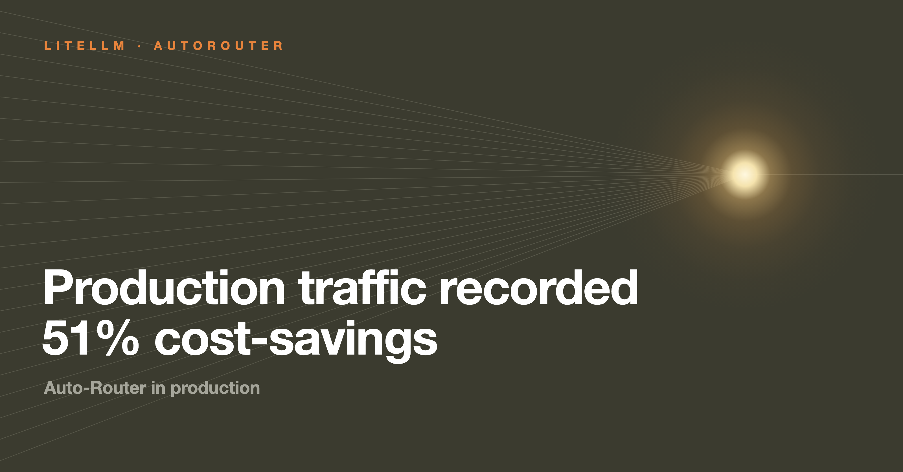

You can expect roughly 40% cost reductions from day one with the Auto Router, and more as the tier maps are tuned. One of our production users shared their statistics to show what that looks like at scale.

They rolled out the Auto-Router to 450+ users across dev, staging, and prod instances and saved **$12,249 over 270k+ requests**.



{/* truncate */}

:::info[🚀 Help shape the Auto-Router]

Get early access, work directly with the LiteLLM team, and influence the roadmap with your production traffic.

<a className="button button--primary button--lg" style={{background: '#2e8555', borderColor: '#2e8555', color: '#fff'}} href="https://calendar.app.google/i2e7qVEJphHi5S8UA">Apply to Become a Design Partner</a>

:::

## Key findings

- **Half the bill.** $12,249 saved on $23,985 of would-be flagship spend, a 51.1% reduction
- **95% of requests never needed the flagship tier.** Blended cost landed at $1.66 per 1M tokens against $3.39 per 1M at the flagship
- **The savings rate kept climbing**, from 42.9% in the first full month to 60.7% by August, as the team tuned the tier maps
- **Nothing changed in their applications.** Users kept calling one model name and the router picked the tier

| | |
| --- | --- |
| Requests through the auto-routers | 272,876 |
| Tokens | 7.08 B |
| Distinct end users | 450+ |
| Window | 2026-04-15 to 2026-08-09 |
| **Actual spend** | **$11,736** |
| Cost if every request had gone to the top tier | $23,985 |
| **Saved** | **$12,249 (51.1%)** |

That 95% number is the whole thesis. Nineteen out of twenty requests did not need the biggest model, and nobody had to decide that by hand.

## Three routers, three model families

The Auto-Router works across Anthropic, Gemini, and GPT, so they ran one complexity router per model family and let their users pick a family rather than a model.

Key findings:

- Largest absolute savings came from the busiest and most expensive router
- GPT family (`gpt-auto-latest`) recorded the largest relative savings between its flagship and cheap tier

| Router | Requests | Spent | Saved | Savings |
| --- | --- | --- | --- | --- |
| `claude-auto-latest` | 109,675 | $8,997 | $7,951 | **46.9%** |
| `gemini-auto-latest` | 90,294 | $1,327 | $1,280 | **49.1%** |
| `gpt-auto-latest` | 72,906 | $1,412 | $3,019 | **68.1%** |

## It got better every month

The savings rate is still climbing as the tier maps mature.

| Month | Saved | Savings rate |
| --- | --- | --- |
| 2026-05 | $2,282 | 42.9% |
| 2026-06 | $3,274 | 50.0% |
| 2026-07 | $4,917 | 53.7% |
| 2026-08 (to the 9th) | $1,769 | **60.7%** |

- Month one already returned 43%, which is the install-it-and-walk-away number
- Four months in they are at **60.7%**
- The difference is tuning. As the team learned which prompts belonged in which tier, they adjusted the maps

Day-one value is real, and it compounds.

## How it was measured

This is production traffic rather than a curated benchmark. 450+ real people, every environment including dev and staging with all the messy traffic that implies, four months rather than a single afternoon, and no prompt curation at all; whatever users typed is what got routed.

The method matters as much as the number, so here it is in full.

- Numbers come straight from **`LiteLLM_SpendLogs`**, with no sampling and no estimation
- Every row records the requested `model_group`, the model the router **actually** served, and the full token split: fresh input, cache read, cache write, output
- For each request, the **exact same tokens**, with the same cache read and write split, are re-priced at that router's **REASONING-tier model**
- That re-price is the counterfactual, meaning "what if we had always called the flagship"
- Prices come from **the same loaded LiteLLM cost map** that produced the recorded spend, so both sides are like-for-like USD list price
- Flagship prices did not change over the window (opus $5/$25, gemini pro $2/$12, gpt flagship $5/$30 per 1M), so the baseline needs no time-varying assumption

Two caveats belong with the number:

1. **This is a model, not an A/B test.** It assumes the flagship would have emitted the same number of output tokens. Flagships usually emit more, because of reasoning tokens, so 51% is a conservative floor rather than a ceiling
2. **Prices are USD list prices** from the cost map, not the customer's invoiced amounts

## The config

This is the shape they deployed, one router per model family:

```yaml title="config.yaml"
model_list:
  - model_name: claude-haiku-4-5           # $1 / $5 per 1M tokens
    litellm_params:
      model: anthropic/claude-haiku-4-5
      api_key: os.environ/ANTHROPIC_API_KEY
  - model_name: claude-sonnet-5            # $3 / $15
    litellm_params:
      model: anthropic/claude-sonnet-5
      api_key: os.environ/ANTHROPIC_API_KEY
  - model_name: claude-opus-5              # $5 / $25
    litellm_params:
      model: anthropic/claude-opus-5
      api_key: os.environ/ANTHROPIC_API_KEY

  - model_name: claude-auto-latest
    litellm_params:
      model: auto_router/complexity_router
      complexity_router_config:
        tiers:
          SIMPLE:    claude-haiku-4-5
          MEDIUM:    claude-haiku-4-5
          COMPLEX:   claude-sonnet-5
          REASONING: claude-opus-5
      complexity_router_default_model: claude-haiku-4-5
```

Note that SIMPLE and MEDIUM both point at the cheapest model rather than doubling up on the flagship, which is where most of the 95% below-flagship share comes from. The flagship stays reserved for the REASONING tier, which is also the tier the counterfactual prices against.

Point a client at `claude-auto-latest` and every response carries `x-litellm-model-name` and `x-litellm-response-cost`, which is the same instrumentation this study was built on. Full reference, including the classifier and tier-boundary knobs, on the [Auto Routing docs page](/docs/proxy/auto_routing).

## Try it

:::info

Point an agent at an auto router and compare it against your current single model on your own workload. Share numbers or questions in [discussion #32168](https://github.com/BerriAI/litellm/discussions/32168). To work on this with us directly, [apply to be a design partner](https://calendar.app.google/i2e7qVEJphHi5S8UA).

:::
