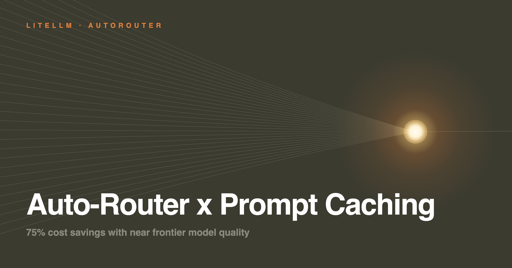

**Yes, you can use prompt caching with Auto-Routing.** The two compound rather than cancel out. We measured it across five datasets, two of which report what the provider's cache actually did.

{/* truncate */}

:::info[🚀 Help shape the Auto-Router]

Get early access, work directly with the LiteLLM team, and influence the roadmap with your production traffic.

<a className="button button--primary button--lg" style={{background: '#2e8555', borderColor: '#2e8555', color: '#fff'}} href="https://calendar.app.google/i2e7qVEJphHi5S8UA">Apply to Become a Design Partner</a>

<br /><br />

Already testing it? Share your results in [discussion #32168](https://github.com/BerriAI/litellm/discussions/32168).

:::

## The results

- **Auto-routing does not break prompt caching.** The two compound on every dataset we measured
- **37% to 69% cheaper** than caching alone on a single model
- **The real failure mode is the opposite one.** Running a router with caching switched off is about **4x more expensive** than caching one fixed model

| Evaluation | Sample | Router + caching, vs caching alone |
| --- | --- | --- |
| Simulation, general chat ([WildChat-1M](https://huggingface.co/datasets/allenai/WildChat-1M)) | 30,769 multi-turn conversations | **68.7% cheaper** |
| Simulation, developer chat ([DevGPT](https://github.com/NAIST-SE/DevGPT)) | 1,011 conversations | **46% cheaper** |
| Real agent traces, provider cache accounting | 95 sessions, 8,174 API calls | **37.4% cheaper** |
| [TwinRouterBench](https://github.com/CommonstackAI/TwinRouterBench) static track | 81 multi-step instances | **44 to 50% cheaper** |

## How it was measured

- **Router arm:** one model group, four tiers. SIMPLE to `claude-haiku-4-5`, MEDIUM to `claude-sonnet-5`, COMPLEX and REASONING to `claude-opus-5`
- **Baseline arm:** every request to one frontier model with prompt caching on, the strongest realistic baseline rather than a cold-priced strawman
- **Cache behaviour:** read from `usage.cache_read_input_tokens` and `cache_creation_input_tokens` on the gateway spend logs and agent traces; modelled on the other three legs
- **Turn classification:** one window function partitioned by session and model, labelling each turn as staying on a model, first visiting a tier, or returning to one already used

## Why auto-routing doesn't break prompt caching

**99.3% of the time a session switches back to a model it used earlier, that model's cache is still warm.** The router comes back long before the cache expires, so a switch is not an eviction.

We measured this on **4,684 real switch-backs** from live LiteLLM gateway traffic.

| Provider cache state | % of Model Returns with Warm Cache |
| --- | --- |
| Still warm at 5m TTL | **97.4%** |
| Still warm at 1h TTL | **99.3%** |
| Past TTL, the only ones a switch could have hurt | **2.6% / 0.7%** |

## We tried a background cache warmer. It wasn't worth it

If switching really did strand the cache, a background refresher that replays a session's prefix would be the fix. We built the measurement for it first.

**Only 4% of cache misses are preventable by a background cache warmer.** The rest either happened while the cache was still alive, or after the model had been idle so long that keeping it warm costs more than the write it avoids.

| Traffic | Typical prefix | What warming does to total cost |
| --- | --- | --- |
| General chat | ~1,700 tokens | **0.10% more expensive** |
| Agent traces, multi-hour gaps | large | **0.63% more expensive** |
| Our gateway, agentic | ~190,000 tokens | **0.9% cheaper** |

Warming is worth roughly plus or minus two percent: a narrow optimization for long sessions with large stable prefixes, not the thing standing between a deployment and its savings.

## See it on your own traffic

The Auto-Router Benchmarks tab now reports prompt cache behaviour per router, from the provider's own usage payload:

- **Hit rate**, split by whether the turn stayed on a model, first visited a tier, or returned to one
- **Expired-miss share**, narrowing return misses to those whose tier went idle past the TTL
- **Savable by warming**, the share of all misses a refresher could prevent
- **Warming cost and net estimate**, in dollars
- **Coverage**, so a low hit rate caused by response logging being off does not read as a cold cache

```
GET /auto_router/benchmarks?start_date=2026-07-01&end_date=2026-07-31
```

## Try it

:::info

Point a client at an auto-router with prompt caching on, then check the Auto-Router Benchmarks tab against your own traffic. Share numbers or questions on [discussion #32168](https://github.com/BerriAI/litellm/discussions/32168). To work on this with us directly, [apply to be a design partner](https://calendar.app.google/i2e7qVEJphHi5S8UA).

:::

```yaml title="config.yaml"
model_list:
  - model_name: claude-haiku-4-5
    litellm_params:
      model: anthropic/claude-haiku-4-5
      api_key: os.environ/ANTHROPIC_API_KEY
  - model_name: claude-sonnet-5
    litellm_params:
      model: anthropic/claude-sonnet-5
      api_key: os.environ/ANTHROPIC_API_KEY
  - model_name: claude-opus-5
    litellm_params:
      model: anthropic/claude-opus-5
      api_key: os.environ/ANTHROPIC_API_KEY

  - model_name: smart-router
    litellm_params:
      model: auto_router/complexity_router
      complexity_router_config:
        tiers:
          SIMPLE:    claude-haiku-4-5
          MEDIUM:    claude-sonnet-5
          COMPLEX:   claude-opus-5
          REASONING: claude-opus-5
        classifier_type: heuristic
      complexity_router_default_model: claude-sonnet-5
```

Every response carries `x-litellm-model-name` and `x-litellm-response-cost`, and the provider's cache token counts land in the spend logs. Full reference on the [Auto Routing docs page](/docs/proxy/auto_routing).
