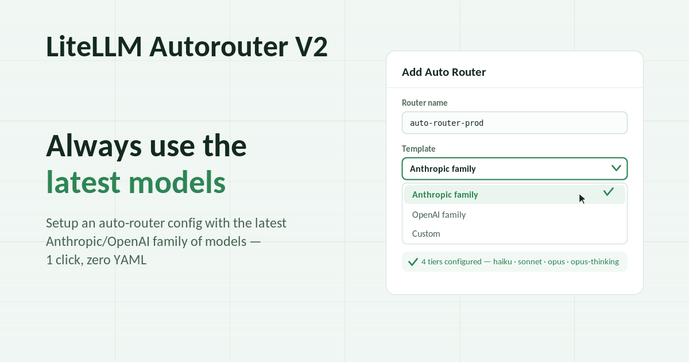
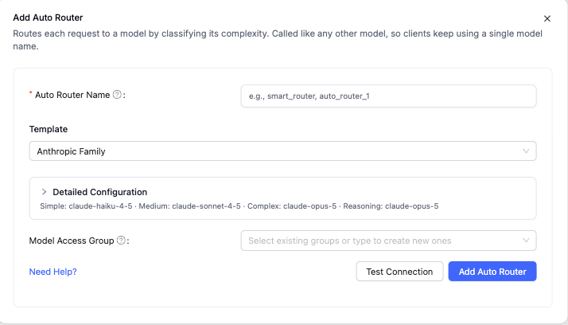

We've made it easier than ever to setup and test your Auto-Router, and with customizable tier names + classifier system prompts you can go beyond complexity routing. 

{/* truncate */}

:::info Availability

Everything below ships in **v1.97.x**.

:::

:::info[🚀 Help shape the Auto-Router]

Get early access, work directly with the LiteLLM team, and influence the roadmap with your production traffic.

<a className="button button--primary button--lg" style={{background: '#2e8555', borderColor: '#2e8555', color: '#fff'}} href="https://calendar.app.google/i2e7qVEJphHi5S8UA">Apply to Become a Design Partner</a>

<br /><br />

Already testing it? Share your results in [discussion #32168](https://github.com/BerriAI/litellm/discussions/32168).

:::

## 1-Click Presets for Anthropic and OpenAI Families



- Add Auto Router now opens on a name field and a **Template** dropdown: Anthropic family, OpenAI family, or Custom
- Picking a family builds the whole config for you with the **latest models** in that family, so every tier is on current models without writing any YAML
- The detail collapses behind a one-line tier summary; presets that reference a model your proxy doesn't serve grey out and tell you which one is missing
- More families are coming; today Anthropic and OpenAI are covered, and Custom is there for everything else

## Let your agent set up the router

Paste this into Claude Code, Codex, Cursor, or any agent with shell access:

```
run curl -fsSL https://docs.litellm.ai/skills/auto-router and follow the instructions
```

- It reads the models your proxy already serves, then interviews you for the router name and the model behind each tier
- It writes the config for you, whether your proxy is file-based or DB-managed
- Before finishing it lists the defaults it left in place, with what changing each one buys, and asks whether you want any changed

## Test Routing in the UI during setup

- **Test Routing** now sits beside Test Connection on the Add Auto Router form
- Send a prompt, see the tier it lands in and why, against the config currently on screen
- Nothing is created and nothing is sent to the routed model, so it costs nothing beyond your LLM classifier (if enabled)

## Replace the classifier's system prompt

The LLM classifier shipped with one built-in rubric, so the router could only grade complexity. `classifier_llm_config.system_prompt` now allows you to define your own routing criteria, whether you want a more in-depth prompt for complexity or routing based on another criterion such as data sensitivity or model capability (vision, audio, image).

- `classifier_fallback` decides what happens when classification fails: the heuristic scorer, or straight to `default_model`

## Customize your tiers

Along with the above change, you can now change the tier names from the default: SIMPLE / MEDIUM / COMPLEX / REASONING. If your team prefers Fast / Standard / Premium / Deep or Image / Video / Audio / Text, an optional `tier_labels` map renames them.

- Names change in the dashboard, the spend logs, and the LLM classifier's rubric, so the classifier reasons in your vocabulary
- Display-only. Config keys stay canonical, routing behavior doesn't move, and API callers never see these names
- Partial maps are fine; unlisted tiers keep the default name

## Configurable reminder markers, easy OpenClaw integration

The router strips harness-injected context before classifying, so a token-budget note doesn't get graded as the user's actual question. That marker pair was hardcoded to `<system-reminder>`; a new `reminder_markers` field lets harnesses like OpenClaw use their own markers.

```yaml
complexity_router_config:
  reminder_markers:
    - "<<<begin_ctx>>>"
    - "<<<end_ctx>>>"
```

## Try it

:::info

Start with the one-line agent command, or open Add Model → Auto Router in the dashboard and pick a family preset. Questions and results in [discussion #32168](https://github.com/BerriAI/litellm/discussions/32168), or [apply to be a design partner](https://calendar.app.google/i2e7qVEJphHi5S8UA) to work on this with us directly.

:::

Full reference on the [Auto Routing docs page](/docs/proxy/auto_routing).
