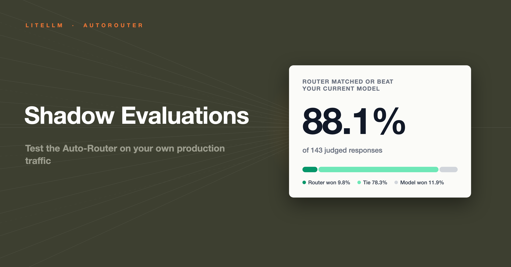
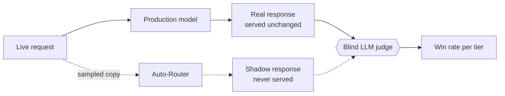

We have shown the Auto-Router [saving 51% in production](/blog/auto-router-production-savings) and [69% stacked on prompt caching](/blog/auto-router-prompt-caching-benchmark). The question we hear next is always the same: **"would it hold quality on my traffic?"**



{/* truncate */}

:::info[🚀 Help shape the Auto-Router]

Get early access, work directly with the LiteLLM team, and influence the roadmap with your production traffic.

<a className="button button--primary button--lg" style={{background: '#2e8555', borderColor: '#2e8555', color: '#fff'}} href="https://calendar.app.google/i2e7qVEJphHi5S8UA">Apply to Become a Design Partner</a>

:::

Shadow evaluations answer that on your own production traffic, and boil it down to one number. On our own traffic below: **the router matched or beat the current model on 88.1% of judged responses**. Nothing your users see changes while it runs.

## What a shadow eval does

- **Samples a slice of one key's live traffic**; you pick the percentage
- **Duplicates each sampled request through the auto-router.** The caller still gets the real response; the shadow response is never served to anyone
- **A blind LLM judge compares the two answers.** It sees answer A and answer B, never which arm produced them
- **You get a win rate**: real vs. router, overall and per complexity tier



## Two questions it answers

| Direction | Question | Real arm | Shadow arm |
| --- | --- | --- | --- |
| `forward` | Should this key adopt the router? | The model the key calls today | The router's pick |
| `reverse` | Is the router still worth it? | The router's pick, already serving the key | A fixed baseline model, e.g. the flagship |

In forward mode, a shadow arm at rough parity means the router matches your current model's quality at a fraction of the cost. In reverse mode, the real arm holding its own means the router keeps earning its place.

## Safe on production traffic by construction

- The user-facing response is untouched; the shadow arm is a duplicate nobody receives
- Only the one key you pick is sampled, at the percentage you set
- `max_turns` is a hard sample budget (default 200, max 2,000); the job judges at most that many turns, then completes. Judge spend is bounded at roughly one judge call per turn
- `duration_days` auto-stops the job (default 7, max 30); you can stop it earlier at any time
- Requests with logging redaction on are never sampled
- Works across `/chat/completions`, `/v1/messages`, and `/v1/responses` traffic

## Reading the results

One glance answers the question. A completed job on our own traffic, 143 judged turns for $1.55 of judge spend:


Ties are the point. The router mostly picks a cheaper model, so every tie is the same quality at a lower price; here only 11.9% of turns preferred the current model, and per-tier slices show exactly where those live.

The job also reports:

- **Win rates**: real wins, shadow wins, and ties, as shares of judged turns
- **Per complexity tier**, so you can see exactly which tier a quality gap lives in and fix that one tier's model instead of abandoning the router
- **Average judge confidence** per slice
- **Judge spend so far**, tracked on the job

At 88.1% matched-or-beat, the remaining question is not quality; it is why you are still paying flagship prices for every request.

## Start a shadow evaluation on your own production traffic

In the UI: **Cost Optimization → Auto Router → Shadow Evals**, pick a key and a router, start. Or over the API:

```bash
curl -X POST 'http://localhost:4000/auto_router/shadow_eval/start' \
  -H 'Authorization: Bearer sk-admin' \
  -H 'Content-Type: application/json' \
  -d '{
    "api_key_id": "88dc28..",
    "router_name": "claude-auto-latest",
    "shadow_percentage": 10
  }'
```

The judge defaults to `anthropic/claude-sonnet-5`; a mid-tier judge is the sweet spot, since it only has to compare two answers. Poll `GET /auto_router/shadow_eval/{job_id}` for live results while the job runs.

## Try it

:::info

Start a shadow eval against a key you already run in production and let it judge a week of real traffic. Share numbers or questions in [discussion #32168](https://github.com/BerriAI/litellm/discussions/32168). To work on this with us directly, [apply to be a design partner](https://calendar.app.google/i2e7qVEJphHi5S8UA).

:::

```yaml title="config.yaml"
model_list:
  - model_name: claude-haiku-4-5
    litellm_params:
      model: anthropic/claude-haiku-4-5
      api_key: os.environ/ANTHROPIC_API_KEY
  - model_name: claude-sonnet-5
    litellm_params:
      model: anthropic/claude-sonnet-5
      api_key: os.environ/ANTHROPIC_API_KEY
  - model_name: claude-opus-5
    litellm_params:
      model: anthropic/claude-opus-5
      api_key: os.environ/ANTHROPIC_API_KEY

  - model_name: claude-auto-latest
    litellm_params:
      model: auto_router/complexity_router
      complexity_router_config:
        tiers:
          SIMPLE:    claude-haiku-4-5
          MEDIUM:    claude-haiku-4-5
          COMPLEX:   claude-sonnet-5
          REASONING: claude-opus-5
      complexity_router_default_model: claude-haiku-4-5
```

Full reference, including every shadow eval knob, on the [Auto Routing docs page](/docs/proxy/auto_routing).
