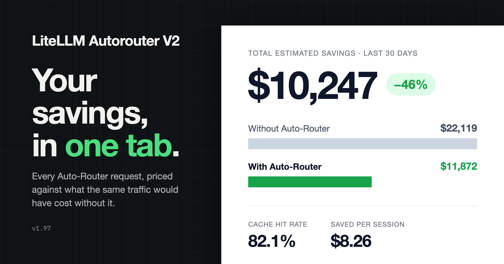

{/* truncate */}

:::info[🚀 Help shape the Auto-Router]

Get early access, work directly with the LiteLLM team, and influence the roadmap with your production traffic.

<a className="button button--primary button--lg" style={{background: '#2e8555', borderColor: '#2e8555', color: '#fff'}} href="https://calendar.app.google/i2e7qVEJphHi5S8UA">Apply to Become a Design Partner</a>

  

Already testing it? Share your results in [discussion #32168](https://github.com/BerriAI/litellm/discussions/32168).

:::

Everything below ships in **v1.97.x**.

## See Auto-Router savings + usage benchmarked against a relevant model

The most common question from teams piloting the Auto-Router is "how much is this actually saving me". There is now a tab that answers it.

Cost Optimization has a new **Auto-Router Usage** tab. It covers the last 24 hours, 7 days, or 30 days, for a single router or all routers combined, and shows:

- **Total estimated savings:** in $ and %, with your actual routed spend next to what the same traffic would have cost if every request went to the most expensive model in the router. It prices the router against the "just always use the best model" setup it replaces, and the estimate accounts for caching in both directions
- **Usage:** total sessions and turns on the Auto-Router, plus per-session averages for spend, turns, duration, and tokens
- **Prompt caching:** the overall cache hit rate, broken down by what the router did on each turn (stayed on the same model, first visit to a tier, or returned to a tier used earlier), so you can tell whether a longer cache TTL or a background cache warmer would pay for itself

The numbers come from a new per-session rollup table so the tab stays fast at scale; in our load tests, a 30-day window over 400k sessions reads in 38 ms.

Next up: benchmarking the Auto-Router quality and # of turns against equivalent usage for your org.

## Per-request logging of the LLM classifier cost

When the complexity router uses an LLM classifier, that classifier call is billed, but until now it was invisible on the request that triggered it. You can now quantify routing overhead per request.

- The classifier call's cost is recorded on the `routing_decision` record as `classifier_cost`, so it reaches spend-log metadata and every `StandardLoggingPayload` consumer (Langfuse, OTel, S3, and the rest)
- A new `x-litellm-classifier-cost` response header reports it per request on `/v1/chat/completions`, `/v1/messages` and `/v1/responses`, streaming included

## Presets now match your actual deployments

The 1-click Anthropic and OpenAI presets no longer depend on your deployment names lining up with what the preset expects.

- Presets now resolve against your deployment's underlying provider model ID (`litellm_params.model`, plus `model_info.base_model` where set) instead of a direct string match on the name
- Presets that resolve this way show a "Matches your deployments" hint, sort ahead of unavailable ones, and keep the config open so you see what got mapped

## Long prompts no longer fail at the routing step

Previously, when using semantic routing long prompts could fail due to an embedding-model's short context window. 
- The prompt is now truncated before embedding, at 2000 characters by default, tunable per deployment with `auto_router_max_input_chars`.
- The truncation applies to the routing step only; guardrails and filters still see the whole prompt
- Every no-match and route-failure path now resolves to `default_model` instead of erroring

## Keyword-based routing now supports Chinese, Japanese and Korean characters

`keyword_tier_rules` matched on regex word boundaries, which do not exist between CJK characters, so a rule on `发票` never fired inside `我需要开发票`. That traffic silently fell through to complexity scoring.

- Keywords containing CJK characters now match as substrings
- Latin keywords keep word-boundary matching unchanged

## Try it

:::info

Open Cost Optimization in the dashboard and pick the Auto-Router Usage tab. Questions and results in [discussion #32168](https://github.com/BerriAI/litellm/discussions/32168), or [apply to be a design partner](https://calendar.app.google/i2e7qVEJphHi5S8UA) to work on the Auto-Router with us directly.

:::

Full reference on the [Auto Routing docs page](/docs/proxy/auto_routing).
