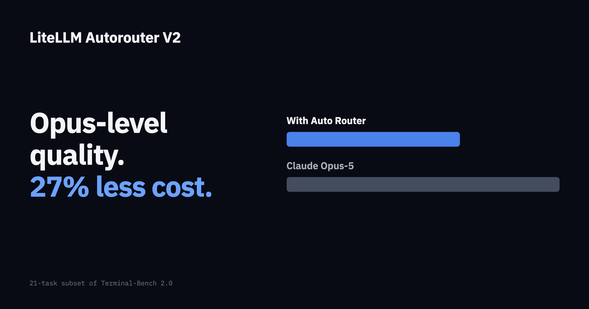
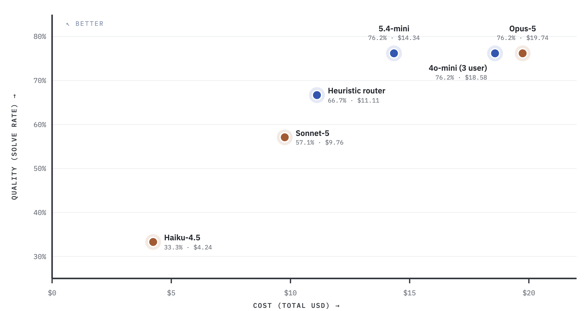

**An auto router matched Claude Opus-5 solve rate on a 21 task subset of Terminal-Bench 2.0 at 27% lower cost.** Every arm ran the same 21 tasks, so the comparisons are like for like.

{/* truncate */}

:::info[🚀 Help shape the Auto-Router]

Get early access, work directly with the LiteLLM team, and influence the roadmap with your production traffic.

<a className="button button--primary button--lg" style={{background: '#2e8555', borderColor: '#2e8555', color: '#fff'}} href="https://calendar.app.google/i2e7qVEJphHi5S8UA">Apply to Become a Design Partner</a>

<br /><br />

Already testing it? Share your results in [discussion #32168](https://github.com/BerriAI/litellm/discussions/32168).

:::

## Key findings

- **Opus level quality at 27% lower cost.** The 5.4-mini classifier (single message context) router solved 16/21 tasks, the same as Opus-5, for $14.34 against $19.74
- **Instead of increasing context-window, consider a better model** Going from 1-message context to the last 3 user messages took the 4o-mini router from 66.7% to 76.2%, and cost from $12.86 to $18.58: +14% relative quality, +44% cost. GPT 5.4-mini classifier with 1-message context beats these results at lower cost. 
- **Context slows tasks down.** Median wall clock per task went from 6.8 min to 8.3 min when adding 3-6 messages as context
- **Adding assistant replies isn't worth it.** A window of 6 messages including LLM replies *dropped* relative quality 7% (66.7% to 61.9%) and raised cost 34%
- **The heuristic router is a good value option.** 87% of Opus quality at 56% of the cost, with no classifier call and the lowest median wall clock of any arm



## Results

| Configuration | Solve rate | Solved/n | Total cost | $/solved | Median task wall clock | p95 turn | Haiku/Sonnet/Opus | Switch rate | Cache hit |
|---|---:|---:|---:|---:|---:|---:|---|---:|---:|
| Router: 5.4-mini | 76.2% | 16/21 | **$14.34** | $0.90 | 6.7 min | 62.8s | 20%/39%/40% | 54% | 78% |
| Router: 4o-mini (3 user) | 76.2% | 16/21 | $18.58 | $1.16 | 8.3 min | 67.9s | 18%/36%/45% | 55% | 78% |
| Opus-5 only | 76.2% | 16/21 | $19.74 | $1.23 | 6.4 min | 94.6s | 0%/0%/99% | 4% | 89% |
| Router: heuristic | 66.7% | 14/21 | $11.11 | $0.79 | 5.6 min | 43.3s | 32%/53%/14% | 48% | 83% |
| Router: 4o-mini (1-message) | 66.7% | 14/21 | $12.86 | $0.92 | 6.8 min | 53.1s | 33%/34%/34% | 58% | 79% |
| Router: 4o-mini (6 both) | 61.9% | 13/21 | $17.23 | $1.33 | 6.3 min | 112.3s | 5%/50%/44% | 46% | 80% |
| Sonnet-5 only | 57.1% | 12/21 | $9.76 | $0.81 | 8.5 min | 60.5s | 0%/99%/0% | 1% | 93% |
| Haiku-4.5 only | 33.3% | 7/21 | $4.24 | $0.61 | 4.9 min | 12.6s | 100%/0%/0% | 0% | 93% |

Cost is the total for all 21 tasks and includes the classifier call, which ran between $0.05 and $0.34 depending on the classifier.

## Breakdown of Context Window Results

`1-message` sends only the current user message to the classifier. `3 user` sends the last 3 user messages. `6 both` sends the last 6 messages including assistant replies. All three use the same 4o-mini classifier and the same tier mapping, so the only variable is what the classifier reads. 5.4-mini with no context beat all, overall.

| Context window | Solve rate | Relative to 1-message | Total cost | Relative to 1-message | Median task wall clock |
|---|---:|---:|---:|---:|---:|
| 1-message | 66.7% | reference | $12.86 | reference | 6.8 min |
| Last 3 user messages | 76.2% | +14% | $18.58 | +44% | 8.3 min |
| Last 6 messages, user and assistant | 61.9% | -7% | $17.23 | +34% | 6.3 min |

Prior user turns tell the classifier what the task actually is, so it escalates to Opus on the turns that need it: the Opus share goes from 34% to 45%, which is where most of the extra cost comes from. Assistant replies pull in tool output and long generated text that read as complexity signal without adding task intent; that arm routed almost nothing to Haiku (5%) yet still scored worst of the three.

## How it was measured

- **Benchmark:** a 21 task subset of Terminal-Bench 2.0, completed by all 8 arms: adaptive-rejection-sampler, build-pmars, chess-best-move, cobol-modernization, crack-7z-hash, filter-js-from-html, gcode-to-text, install-windows-3.11, largest-eigenval, llm-inference-batching-scheduler, merge-diff-arc-agi-task, multi-source-data-merger, overfull-hbox, password-recovery, polyglot-c-py, prove-plus-comm, pypi-server, sparql-university, train-fasttext, winning-avg-corewars, write-compressor
- **Router arms:** one model group, four tiers. SIMPLE to `claude-haiku-4-5`, MEDIUM to `claude-sonnet-5`, COMPLEX and REASONING to `claude-opus-5`. Classifier is either the heuristic or an LLM (`gpt-4o-mini`, `gpt-5.4-mini`)
- **Baseline arms:** every request to one fixed model, with prompt caching on in all arms
- **Cost:** total USD across all 21 tasks from gateway spend logs, classifier calls included
- **Errors:** 0 to 4 per arm, from harness and provider failures, excluded from solve rate denominators only where the task did not complete for that arm

## Config

```yaml title="config.yaml"
model_list:
  - model_name: claude-haiku-4-5
    litellm_params:
      model: anthropic/claude-haiku-4-5
      api_key: os.environ/ANTHROPIC_API_KEY
  - model_name: claude-sonnet-5
    litellm_params:
      model: anthropic/claude-sonnet-5
      api_key: os.environ/ANTHROPIC_API_KEY
  - model_name: claude-opus-5
    litellm_params:
      model: anthropic/claude-opus-5
      api_key: os.environ/ANTHROPIC_API_KEY

  - model_name: smart-router
    litellm_params:
      model: auto_router/complexity_router
      complexity_router_config:
        tiers:
          SIMPLE:    claude-haiku-4-5
          MEDIUM:    claude-sonnet-5
          COMPLEX:   claude-opus-5
          REASONING: claude-opus-5
        classifier_type: llm
        classifier_llm_config:
          model: gpt-5.4-mini
        classifier_context_window_size: 0
      complexity_router_default_model: claude-sonnet-5
```

Every response carries `x-litellm-model-name` and `x-litellm-response-cost`, and per router cost and usage land in the Auto-Router Benchmarks tab. Full reference on the [Auto Routing docs page](/docs/proxy/auto_routing).

## Try it

:::info

Point an agent at an auto router and compare it against your current single model on your own workload. Share numbers or questions in [discussion #32168](https://github.com/BerriAI/litellm/discussions/32168). To work on this with us directly, [apply to be a design partner](https://calendar.app.google/i2e7qVEJphHi5S8UA).

:::
