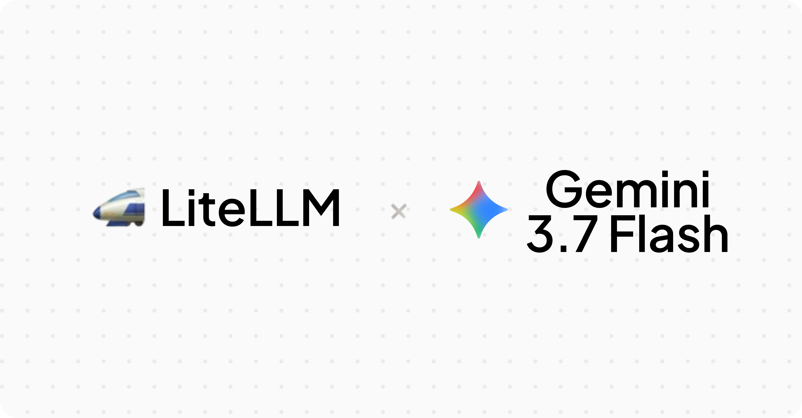

import Tabs from '@theme/Tabs';
import TabItem from '@theme/TabItem';



# Gemini 3.7 Flash day 0 support

LiteLLM now supports `gemini-3.7-flash` on day 0, on both Google AI Studio (`gemini/`) and Vertex AI (`vertex_ai/`). Google's newest Flash model delivers faster responses with meaningfully better quality than 3.6 Flash and scores higher on complex multi-step agentic, coding, and reasoning benchmarks.

{/* truncate */}

:::note
**No Docker image upgrade needed.** Gemini 3.7 Flash routes through the existing Gemini configs, so any recent LiteLLM version works out of the box for inference. For cost tracking, hit the **Reload Model Cost Map** button in the Admin UI (or `POST /reload/model_cost_map`) to pull the latest pricing from GitHub. This is available on `v1.76.0` and above. The `gemini-3.7-flash` pricing and metadata are also bundled starting in `v1.98.0-dev.2` for anyone running with `LITELLM_LOCAL_MODEL_COST_MAP=true`.
:::

## Launch pricing

Gemini 3.7 Flash launches at a 50% discount that runs through December 31, 2027. LiteLLM tracks cost at the promotional rate.

| | Promotional | Standard |
|---|---|---|
| Input | $0.75 / 1M tokens | $1.50 / 1M tokens |
| Output | $3.75 / 1M tokens | $7.50 / 1M tokens |

Cache reads, batch, flex, and priority tiers are discounted proportionally.

## Quick Start

<Tabs>
<TabItem value="sdk" label="SDK">

```python
from litellm import completion

response = completion(
    model="gemini/gemini-3.7-flash",
    messages=[{"role": "user", "content": "Summarize this article in 3 bullet points."}],
)

print(response.choices[0].message.content)
```

</TabItem>

<TabItem value="proxy" label="PROXY">

**1. Setup config.yaml**

```yaml
model_list:
  - model_name: gemini-3.7-flash
    litellm_params:
      model: gemini/gemini-3.7-flash
      api_key: os.environ/GEMINI_API_KEY

  # Or use Vertex AI
  - model_name: vertex-gemini-3.7-flash
    litellm_params:
      model: vertex_ai/gemini-3.7-flash
      vertex_project: your-project-id
      vertex_location: us-central1
```

**2. Start proxy**

```bash
litellm --config /path/to/config.yaml
```

**3. Make requests**

```bash
curl -X POST http://localhost:4000/v1/chat/completions \
  -H "Content-Type: application/json" \
  -H "Authorization: Bearer <YOUR-LITELLM-KEY>" \
  -d '{
    "model": "gemini-3.7-flash",
    "messages": [{"role": "user", "content": "Hello!"}]
  }'
```

</TabItem>
</Tabs>

## Thinking levels

Gemini 3.7 Flash is a reasoning model. LiteLLM maps OpenAI `reasoning_effort` to Gemini's `thinkingLevel`, so the same request shape you use for other reasoning models works here.

```python
from litellm import completion

response = completion(
    model="gemini/gemini-3.7-flash",
    messages=[{"role": "user", "content": "What's 2+2?"}],
    reasoning_effort="low",
)

print(response.choices[0].message.content)
```

:::warning Known limitation at launch
The `minimal` thinking level is not yet supported on `gemini-3.7-flash`. The Gemini API returns a 400 (`Thinking level MINIMAL is not supported for this model`). Google plans minimal thinking support as a fast follow. All other thinking levels work as expected.
:::

## Supported Endpoints

LiteLLM provides full end-to-end support for Gemini 3.7 Flash on:

- `/v1/chat/completions` - OpenAI-compatible chat completions endpoint
- `/v1/responses` - OpenAI Responses API endpoint (streaming and non-streaming)
- [`/v1/messages`](../../docs/anthropic_unified) - Anthropic-compatible messages endpoint
- `/v1/generateContent` - [Google Gemini API](../../docs/generateContent) compatible endpoint

All endpoints support streaming and non-streaming responses, function calling with thought signatures, multi-turn conversations, and full multimodal input (text, image, audio, video).

## Feedback

Running Gemini 3.7 Flash through LiteLLM and hitting something unexpected? Share it on [GitHub discussion #36799](https://github.com/BerriAI/litellm/discussions/36799).
