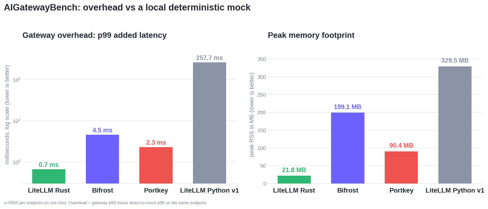
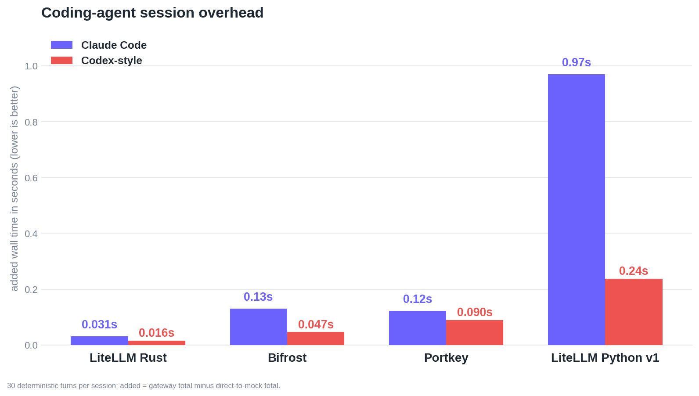
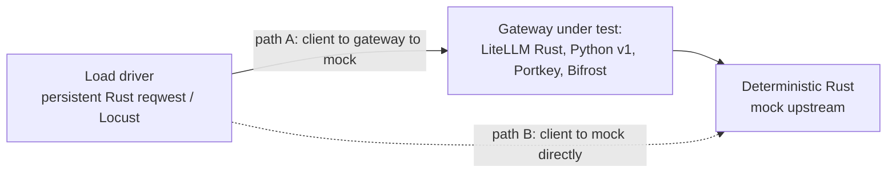

*Last Updated: July 2026*

We are launching an early beta of the LiteLLM AI Gateway in Rust, and we built [AIGatewayBench](https://github.com/BerriAI/ai-gateway-bench) to measure it against Portkey, Bifrost, and the current LiteLLM Python proxy. Across all four, the LiteLLM Rust gateway has the **lowest p99 added latency and the smallest memory footprint by a wide margin**: roughly `7x` lower overhead and `9x` less memory than the next-closest gateway (Bifrost), the lowest cost footprint, and the fastest whole-session times for coding agents. It holds its own on raw sustained throughput and pulls decisively ahead on overhead, memory, and cost.

{/* truncate */}

## The results

**Gateway overhead and memory.** p99 added latency (log scale) and peak memory. Rust adds about `0.7ms` at p99 against `2.3ms` (Portkey), `4.5ms` (Bifrost), and `257.7ms` (Python v1), at `21.8MB` peak memory against `90.4MB`, `199.1MB`, and `329.5MB`.



**Cost footprint.** Estimated USD per one million requests from measured CPU, peak RSS, and sustained throughput on a 4 vCPU / 16 GB instance. Rust lands at about `$0.000175`, roughly `6x` below Bifrost (`$0.001008`) and Portkey (`$0.001042`), and far below Python (`$0.015354`). This is a footprint estimate and excludes token cost, which dominates any real bill.


**Throughput efficiency.** Sustained requests per second per dollar per hour. Rust reaches about `283,833` against `63,246` (Bifrost) because it holds a similar request rate at a fraction of the CPU and memory. On raw sustained RPS, Rust (`~2,814` req/s) edges out Bifrost (`~2,744`); this chart is efficiency per dollar, not peak throughput.


**Agentic coding sessions.** Added wall time across a 30-turn Claude Code and Codex-style loop. Rust adds about `0.03s` and `0.016s`, against `0.13s` / `0.047s` (Bifrost), `0.12s` / `0.09s` (Portkey), and `0.97s` / `0.24s` (Python).



## How to reproduce this with AIGatewayBench

Every gateway points at the same local deterministic Rust mock, so provider latency and network jitter drop out and what remains is the gateway's own cost:

```
overhead = latency(client -> gateway -> mock) - latency(client -> mock directly)
```



The gateway's overhead is path A minus path B. Everything except the gateway under test, the mock, the load driver, and the host, is held identical, so the difference is the gateway's own cost. The full harness, per-gateway setup, and raw run data are in [AIGatewayBench](https://github.com/BerriAI/ai-gateway-bench). Start the mock, start a gateway pointed at it, run a scenario, and regenerate the charts:

```bash
python -m venv .venv && . .venv/bin/activate && pip install -r requirements.txt
cargo run --release -p mock-upstream                 # deterministic upstream
# start a gateway from gateways/<name>/README.md, pointed at the mock
python analyze/make_chart.py                          # charts from results/
```

A few things to keep honest when reading these numbers:

- Because the upstream is a local mock, the absolute latencies are the gateway's isolated slice, not real-world request latencies. Read them as comparisons under identical conditions.
- Versions: LiteLLM Rust beta, LiteLLM Python v1 (`litellm[proxy]`), Bifrost `v1.6.4`, current Portkey OSS. Same mock and load driver on one host.
- Every gateway forwards the Anthropic Messages body with no logging callbacks, spend tracking, or persistence enabled. This isolates forwarding overhead; it is not a full-feature comparison, and enabling those would add cost to every gateway, including ours.
- Single-host, per-scenario runs (for example n=5000 on the overhead panel) without repeated-trial error bars, so treat them as order-of-magnitude differences.
- It is a vendor-run benchmark, so the guardrail is reproducibility: every plotted value is a committed CSV in [`results/`](https://github.com/BerriAI/ai-gateway-bench/tree/main/results), and the mock and driver are identical across all four gateways.

## Conclusions

For a single chat turn, gateway overhead is noise next to model latency and none of this should change your decision. Where it matters is high request rate against fast responses (embeddings, classification, guardrails) and agentic loops that issue many turns per task, and in the memory and CPU footprint that decides how many pods you run and how close each sits to an out-of-memory kill.

On those axes the LiteLLM Rust gateway is the strongest of the four we tested: the lowest overhead, the smallest footprint, and the lowest cost per unit of throughput, and a raw sustained RPS that edges out the next-best gateway. It is an early beta, streaming and the full feature surface are still landing, and the fastest way to check any claim here is to run AIGatewayBench against your own build. If you want to run the LiteLLM Rust gateway in your stack, [sign up for the early beta](https://docs.google.com/forms/d/e/1FAIpQLSecWdOjkzjEson2UiZpDftOoZPs8RQbtlAM40KSvDXZqEgYaA/viewform?usp=dialog), and for the architecture behind the migration see [Migrating LiteLLM to Rust](/blog/litellm-rust-launch).
