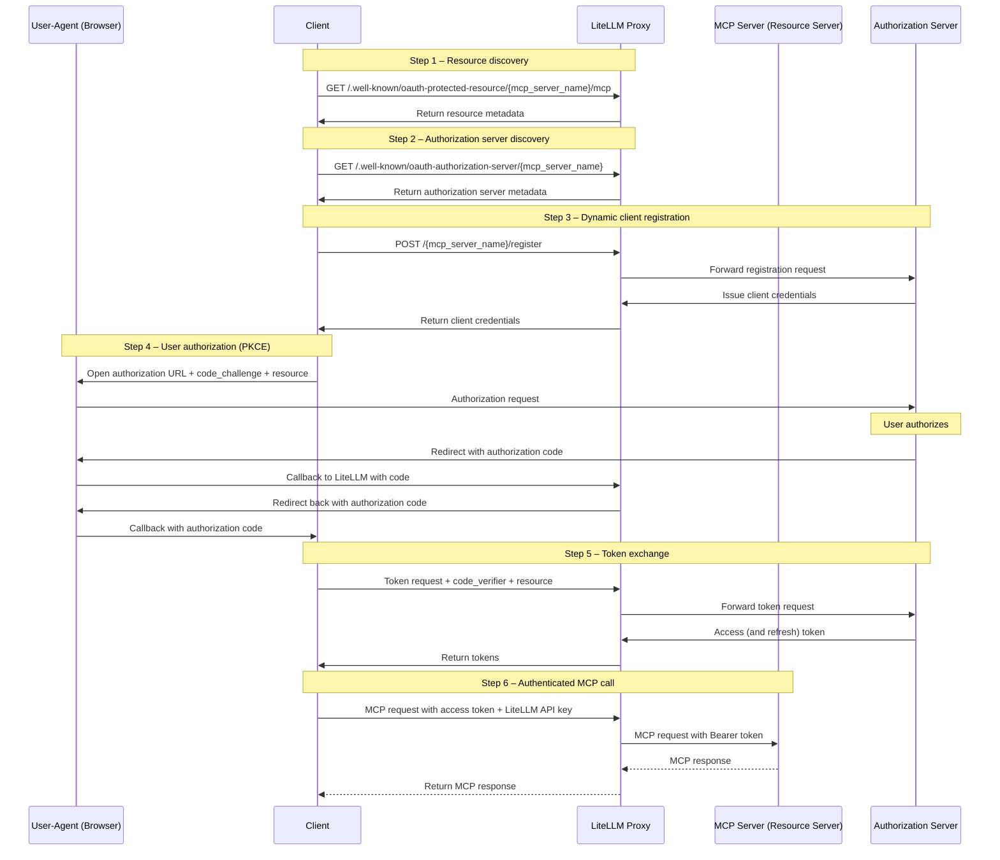
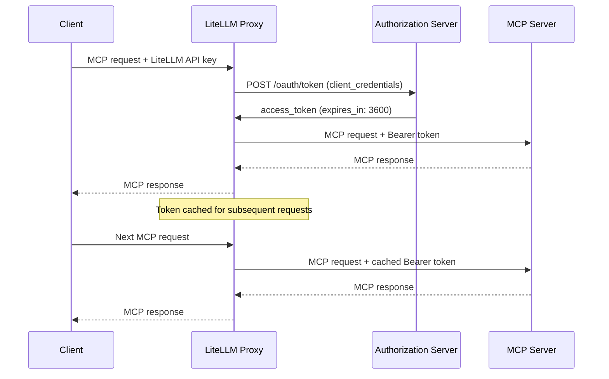

# MCP OAuth

LiteLLM supports several OAuth 2.0 patterns for MCP servers. Every `auth_type: oauth2` server in `config.yaml` must declare its flow via `oauth2_flow`; the passthrough modes are their own `auth_type` values, documented in [MCP OAuth Passthrough](./mcp_oauth_passthrough.md):

| Flow | `oauth2_flow` | Use Case | How It Works |
|------|---------------|----------|--------------|
| **Interactive (PKCE)** | `authorization_code` | User-facing apps (Claude Code, Cursor) | Browser-based consent, per-user tokens |
| **Machine-to-Machine (M2M)** | `client_credentials` | Backend services, CI/CD, automated agents | `client_credentials` grant, proxy-managed tokens |
| **On-Behalf-Of (OBO)** | n/a (uses `auth_type: oauth2_token_exchange`) | User-context tool calls to protected MCP servers | LiteLLM exchanges the caller token for a scoped MCP token. See [MCP OBO Auth](./mcp_obo_auth.md). |
| **Passthrough (transparent)** | n/a (uses `auth_type: true_passthrough`) | Client already holds the upstream token; LiteLLM adds no auth of its own | Forwards the client's `Authorization` verbatim, no LiteLLM admission. [See MCP OAuth Passthrough](./mcp_oauth_passthrough.md) |
| **Delegated upstream OAuth** | n/a (uses `auth_type: oauth_delegate`) | LiteLLM admits the caller; the upstream owns tool authorization | LiteLLM admission plus a separate forwarded upstream bearer, keeps spend and rate limits. [See MCP OAuth Passthrough](./mcp_oauth_passthrough.md) |

## Interactive OAuth (PKCE)

For user-facing MCP clients (Claude Code, Cursor), LiteLLM supports the full OAuth 2.0 authorization code flow with PKCE.

### Setup

```yaml title="config.yaml" showLineNumbers
mcp_servers:
  github_mcp:
    url: "https://api.githubcopilot.com/mcp"
    auth_type: oauth2
    oauth2_flow: authorization_code
    client_id: os.environ/GITHUB_OAUTH_CLIENT_ID
    client_secret: os.environ/GITHUB_OAUTH_CLIENT_SECRET
```

[**See Claude Code Tutorial**](/docs/tutorials/claude_responses_api)

### How It Works



**Participants**

- **Client** -- The MCP-capable AI agent (e.g., Claude Code, Cursor, or another IDE/agent) that initiates OAuth discovery, authorization, and tool invocations on behalf of the user.
- **LiteLLM Proxy** -- Mediates all OAuth discovery, registration, token exchange, and MCP traffic while protecting stored credentials.
- **Authorization Server** -- Issues OAuth 2.0 tokens via dynamic client registration, PKCE authorization, and token endpoints.
- **MCP Server (Resource Server)** -- The protected MCP endpoint that receives LiteLLM's authenticated JSON-RPC requests.
- **User-Agent (Browser)** -- Temporarily involved so the end user can grant consent during the authorization step.

**Flow Steps**

1. **Resource Discovery**: The client fetches MCP resource metadata from LiteLLM's `.well-known/oauth-protected-resource` endpoint to understand scopes and capabilities.
2. **Authorization Server Discovery**: The client retrieves the OAuth server metadata (token endpoint, authorization endpoint, supported PKCE methods) through LiteLLM's `.well-known/oauth-authorization-server` endpoint.
3. **Dynamic Client Registration**: The client registers through LiteLLM, which forwards the request to the authorization server (RFC 7591). If the provider doesn't support dynamic registration, you can pre-store `client_id`/`client_secret` in LiteLLM (e.g., GitHub MCP) and the flow proceeds the same way.
4. **User Authorization**: The client launches a browser session (with code challenge and resource hints). The user approves access, the authorization server sends the code through LiteLLM back to the client.
5. **Token Exchange**: The client calls LiteLLM with the authorization code, code verifier, and resource. LiteLLM exchanges them with the authorization server and returns the issued access/refresh tokens.
6. **MCP Invocation**: With a valid token, the client sends the MCP JSON-RPC request (plus LiteLLM API key) to LiteLLM, which forwards it to the MCP server and relays the tool response.

See the official [MCP Authorization Flow](https://modelcontextprotocol.io/specification/2025-06-18/basic/authorization#authorization-flow-steps) for additional reference.

### Reverse proxy and ingress configuration {#reverse-proxy-and-ingress-configuration}

If LiteLLM runs behind a TLS-terminating ingress (Kubernetes, ALB, nginx, Cloudflare, etc.), the proxy needs to know its public origin so the OAuth `authorize` endpoint can compare the browser-supplied `redirect_uri` (e.g. `https://llm.example.com/ui/mcp/oauth/callback`) against its own scheme + host + port. If the proxy resolves to its internal address (`http://<pod-ip>:4000`) the same-origin check fails and the **Connect** button on the MCP server page returns `400 Bad Request` with `{"detail":"invalid_request"}`.

The simplest and recommended fix is to set `PROXY_BASE_URL` to the exact origin users see in the address bar:

```bash
PROXY_BASE_URL=https://llm.example.com
```

Rules for the value:

- Full origin only: scheme + host (+ port if non-default).
- No trailing slash, no path component.
- Must match the address bar exactly. `https://llm.example.com` and `https://llm.example.com:443` are accepted as the same origin (the default port is normalized away), but `https://llm.example.com` will not match a browser running against `https://llm.example.com:8443`.

When `PROXY_BASE_URL` is set, LiteLLM uses it directly and skips the `X-Forwarded-*` trust path described below.

#### Origin resolution order

For MCP OAuth endpoints, LiteLLM resolves the proxy's public origin in this order:

1. **`PROXY_BASE_URL` env var** — used verbatim if set to a valid `http(s)` URL. Invalid values are ignored with a warning.
2. **`X-Forwarded-Proto` / `X-Forwarded-Host` / `X-Forwarded-Port`** — only honored when **both** [`use_x_forwarded_for`](./proxy/config_settings#general_settings---reference) is `true` **and** the request peer's IP falls inside [`mcp_trusted_proxy_ranges`](./proxy/config_settings#general_settings---reference). If `use_x_forwarded_for` is enabled without `mcp_trusted_proxy_ranges`, the headers are not trusted (there is no way to distinguish a trusted reverse proxy from a direct attacker).
3. **`request.base_url`** — the literal URL FastAPI sees on the request. For ingressed deployments this is typically `http://<internal-host>:4000` and will not match the browser origin.

If you cannot or do not want to set `PROXY_BASE_URL`, configure the X-Forwarded path explicitly:

```yaml title="config.yaml" showLineNumbers
general_settings:
  use_x_forwarded_for: true
  mcp_trusted_proxy_ranges:
    - "10.0.0.0/8"      # your ingress / load-balancer CIDR(s)
```

and verify your ingress sends `X-Forwarded-Proto`, `X-Forwarded-Host`, and (if non-default) `X-Forwarded-Port`. See [MCP OAuth troubleshooting](./mcp_troubleshoot#mcp-oauth-invalid-request) for the diagnostic curl.

#### Allowing additional first-party redirect_uri origins {#allowing-additional-first-party-redirect_uri-origins}

If a first-party OAuth client lives on a sister domain (for example, an internal web app on `app.example.com` registering against the MCP proxy on `llm.example.com`), set `MCP_TRUSTED_REDIRECT_ORIGINS` to allowlist its origin in addition to the proxy's own:

```bash
MCP_TRUSTED_REDIRECT_ORIGINS=app.example.com,*.tools.example.com
```

- Comma-separated list of `host` or `host:port` entries.
- HTTPS only. The allowlist path rejects any non-`https` `redirect_uri`.
- A `*.suffix` entry matches any strictly-deeper subdomain of `suffix` (`*.tools.example.com` matches `a.tools.example.com` but not `tools.example.com`).
- Loopback (`localhost`, `127.0.0.0/8`, `::1`) is always accepted regardless of this setting.

This is for first-party OAuth clients you control. For the standard ingress case, prefer `PROXY_BASE_URL`.

#### Why the same-origin check exists

The MCP proxy's `/v1/mcp/server/oauth/<server_id>/authorize` endpoint validates that the caller's `redirect_uri` shares scheme + host + port with the proxy's own public origin (or with one of the loopback / allowlisted entries above). The check exists to stop an attacker from phishing a logged-in admin into a link that bounces an authorization code, for an upstream OAuth-protected MCP server such as GitHub or Slack, through an attacker-controlled host. Same-origin (plus an explicit ops allowlist) is the threat-model-safe equivalent of the loopback-only rule used for native MCP clients.

`PROXY_BASE_URL` is the right escape hatch for ingressed deployments because the operator is declaring the proxy's true public origin out of band, rather than asking the proxy to infer it from headers an attacker might be able to set. The check itself is not relaxed.

## Machine-to-Machine (M2M) Auth

LiteLLM automatically fetches, caches, and refreshes OAuth2 tokens using the `client_credentials` grant. No manual token management required.

### Setup

You can configure M2M OAuth via the LiteLLM UI or `config.yaml`.

### UI Setup

Navigate to the **MCP Servers** page and click **+ Add New MCP Server**.


Enter a name for your server and select **HTTP** as the transport type.


Paste the MCP server URL.


Under **Authentication**, select **OAuth**.


Choose **Machine-to-Machine (M2M)** as the OAuth flow type. This is for server-to-server authentication using the `client_credentials` grant, with no browser interaction.


Fill in the **Client ID** and **Client Secret** provided by your OAuth provider.


Enter the **Token URL**, the endpoint LiteLLM will call to fetch access tokens using `client_credentials`.


Scroll down and review the server URL and all fields, then click **Create MCP Server**.


Once created, open the server and navigate to the **MCP Tools** tab to verify that LiteLLM can connect and list available tools.


Select a tool (e.g. **echo**) to test it. Fill in the required parameters and click **Call Tool**.


LiteLLM automatically fetches an OAuth token behind the scenes and calls the tool. The result confirms the M2M OAuth flow is working end-to-end.


### Config.yaml Setup

```yaml title="config.yaml" showLineNumbers
mcp_servers:
  my_mcp_server:
    url: "https://my-mcp-server.com/mcp"
    auth_type: oauth2
    oauth2_flow: client_credentials
    client_id: os.environ/MCP_CLIENT_ID
    client_secret: os.environ/MCP_CLIENT_SECRET
    token_url: "https://auth.example.com/oauth/token"
    scopes: ["mcp:read", "mcp:write"]  # optional
```

### How It Works

1. On first MCP request, LiteLLM POSTs to `token_url` with `grant_type=client_credentials`
2. The access token is cached in-memory with TTL = `expires_in - 60s`
3. Subsequent requests reuse the cached token
4. When the token expires, LiteLLM fetches a new one automatically



### Test with Mock Server

Use [BerriAI/mock-oauth2-mcp-server](https://github.com/BerriAI/mock-oauth2-mcp-server) to test locally:

```bash title="Terminal 1 - Start mock server" showLineNumbers
uv add fastapi uvicorn
python mock_oauth2_mcp_server.py  # starts on :8765
```

```yaml title="config.yaml" showLineNumbers
mcp_servers:
  test_oauth2:
    url: "http://localhost:8765/mcp"
    auth_type: oauth2
    oauth2_flow: client_credentials
    client_id: "test-client"
    client_secret: "test-secret"
    token_url: "http://localhost:8765/oauth/token"
```

```bash title="Terminal 2 - Start proxy and test" showLineNumbers
litellm --config config.yaml --port 4000

# See MCP REST API guide for full examples (server_id, tool naming, common errors)
# https://docs.litellm.ai/docs/mcp_rest_api

curl http://localhost:4000/mcp-rest/tools/list \
  -H "Authorization: Bearer sk-1234"

curl http://localhost:4000/mcp-rest/tools/call \
  -H "Content-Type: application/json" \
  -H "Authorization: Bearer sk-1234" \
  -d '{
    "server_id": "test_oauth2",
    "name": "echo",
    "arguments": {"message": "hello"}
  }'
```

### Config Reference

| Field | Required | Description |
|-------|----------|-------------|
| `auth_type` | Yes | Must be `oauth2`. For RFC 8693 On-Behalf-Of, use `oauth2_token_exchange` instead — see [MCP OBO Auth](./mcp_obo_auth.md). |
| `oauth2_flow` | Yes | Flow selector. One of `"client_credentials"` (M2M) or `"authorization_code"` (interactive PKCE, including `delegate_auth_to_upstream`). Required for every `auth_type: oauth2` server in `config.yaml`; the proxy refuses to start if it is missing or invalid. Servers created through the UI get it from the OAuth flow type selector. Only legacy database rows created before this field existed fall back to inference from field shape at request time; config entries are never inferred. |
| `client_id` | Yes for M2M, optional for interactive | OAuth2 client ID. Required for `client_credentials`. For interactive flows, can be obtained via Dynamic Client Registration (RFC 7591) at `POST /{server_name}/register` if the upstream supports it. Supports `os.environ/VAR_NAME`. |
| `client_secret` | Yes for M2M, optional for interactive | OAuth2 client secret. Same applicability as `client_id`. Supports `os.environ/VAR_NAME`. |
| `token_url` | Yes for M2M, optional for interactive | Token endpoint URL. LiteLLM POSTs to this for `client_credentials` and for the authorization-code exchange. |
| `authorization_url` | Interactive only | Upstream authorization endpoint. When present, LiteLLM treats the server as interactive PKCE and proxies `GET /{server_name}/authorize` to this URL. |
| `registration_url` | Optional | Upstream Dynamic Client Registration endpoint (RFC 7591). When present, `POST /{server_name}/register` proxies through to this URL. |
| `scopes` | No | List of scopes to request. For M2M, joined into the `scope` parameter on the token request. For interactive, forwarded on the authorize request. |
| `token_validation` | No | Dict of key-value rules checked against the OAuth token response after the `/token` exchange. Any rule mismatch fails the exchange with `token_validation_failed`. Useful for asserting a tenant claim like `{"team.enterprise_id": "T12345"}`. |
| `token_storage_ttl_seconds` | No | Override the TTL for the per-user token cache (interactive flow). If unset, LiteLLM uses `expires_in - buffer` from the token response. |

## Debugging OAuth

When the LiteLLM proxy is hosted remotely and you cannot access server logs, enable **debug headers** to get masked authentication diagnostics in the HTTP response.

### Enable Debug Mode

Add the `x-litellm-mcp-debug: true` header to your MCP client request.

**Claude Code:**

```bash
claude mcp add --transport http litellm_proxy http://proxy.example.com/atlassian_mcp/mcp \
  --header "x-litellm-api-key: Bearer sk-..." \
  --header "x-litellm-mcp-debug: true"
```

**curl:**

```bash
curl -X POST http://localhost:4000/atlassian_mcp/mcp \
  -H "Content-Type: application/json" \
  -H "x-litellm-api-key: Bearer sk-..." \
  -H "x-litellm-mcp-debug: true" \
  -d '{"jsonrpc":"2.0","id":1,"method":"tools/list","params":{}}'
```

### Reading the Debug Response Headers

The response includes these headers (all sensitive values are masked):

| Header | Description |
|--------|-------------|
| `x-mcp-debug-inbound-auth` | Which inbound auth headers were present. |
| `x-mcp-debug-oauth2-token` | The OAuth2 token (masked). Shows `SAME_AS_LITELLM_KEY` if the LiteLLM key is leaking. |
| `x-mcp-debug-auth-resolution` | Which auth method was used: `oauth2-passthrough`, `m2m-client-credentials`, `per-request-header`, `static-token`, or `no-auth`. |
| `x-mcp-debug-outbound-url` | The upstream MCP server URL. |
| `x-mcp-debug-server-auth-type` | The `auth_type` configured on the server. |

**Example, healthy OAuth2 passthrough:**

```
x-mcp-debug-inbound-auth: x-litellm-api-key=Bearer****1234; authorization=Bearer****ef01
x-mcp-debug-oauth2-token: Bearer****ef01
x-mcp-debug-auth-resolution: oauth2-passthrough
x-mcp-debug-outbound-url: https://mcp.atlassian.com/v1/mcp
x-mcp-debug-server-auth-type: oauth2
```

**Example, LiteLLM key leaking (misconfigured):**

```
x-mcp-debug-inbound-auth: authorization=Bearer****1234
x-mcp-debug-oauth2-token: Bearer****1234 (SAME_AS_LITELLM_KEY - likely misconfigured)
x-mcp-debug-auth-resolution: oauth2-passthrough
x-mcp-debug-outbound-url: https://mcp.atlassian.com/v1/mcp
x-mcp-debug-server-auth-type: oauth2
```

### Common Issues

#### LiteLLM API key leaking to the MCP server

**Symptom:** `x-mcp-debug-oauth2-token` shows `SAME_AS_LITELLM_KEY`.

The `Authorization` header carries the LiteLLM API key instead of an OAuth2 token. The OAuth2 flow never ran because the client already had an `Authorization` header set.

**Fix:** Move the LiteLLM key to `x-litellm-api-key`:

```bash
# WRONG — blocks OAuth2 discovery
claude mcp add --transport http my_server http://proxy/server/mcp \
    --header "Authorization: Bearer sk-..."

# CORRECT — LiteLLM key in dedicated header, Authorization free for OAuth2
claude mcp add --transport http my_server http://proxy/server/mcp \
    --header "x-litellm-api-key: Bearer sk-..."
```

#### No OAuth2 token present

**Symptom:** `x-mcp-debug-oauth2-token` shows `(none)` and `x-mcp-debug-auth-resolution` shows `no-auth`.

Check that:
1. The `Authorization` header is NOT set as a static header in the client config.
2. The MCP server in LiteLLM config has `auth_type: oauth2`.
3. The `.well-known/oauth-protected-resource` endpoint returns valid metadata.

#### M2M token used instead of user token

**Symptom:** `x-mcp-debug-auth-resolution` shows `m2m-client-credentials`.

The server has `client_id`/`client_secret`/`token_url` configured so LiteLLM is fetching a machine-to-machine token instead of using the per-user OAuth2 token. To use per-user tokens, remove the client credentials from the server config.

## Passthrough and Delegated Upstream OAuth

For servers where the client already authenticates directly against the upstream's own OAuth issuer, LiteLLM can forward the client's upstream token instead of managing tokens itself. The transparent `auth_type: true_passthrough` mode, the admission-gated `auth_type: oauth_delegate` mode, and the legacy `delegate_auth_to_upstream` flag are covered in [MCP OAuth Passthrough](./mcp_oauth_passthrough.md). That page also documents the `dcr_bridge` flag for OAuth-only clients such as OpenCode, Claude Code, Cursor, and Claude Desktop, where the gateway hosts registration and sign-in so the client can connect with a single OAuth flow.