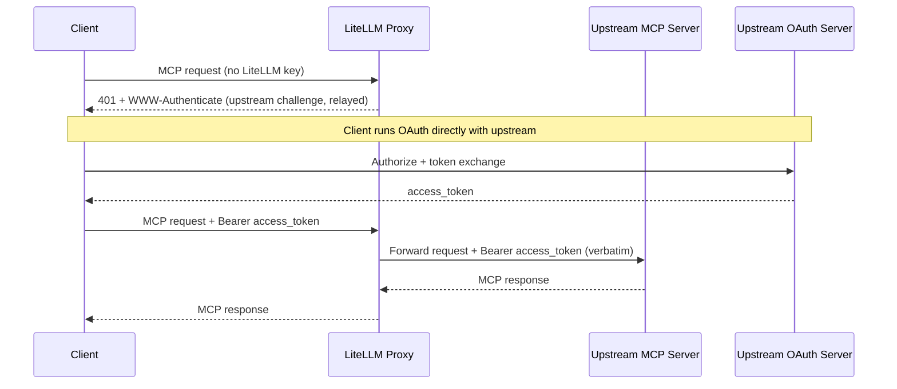
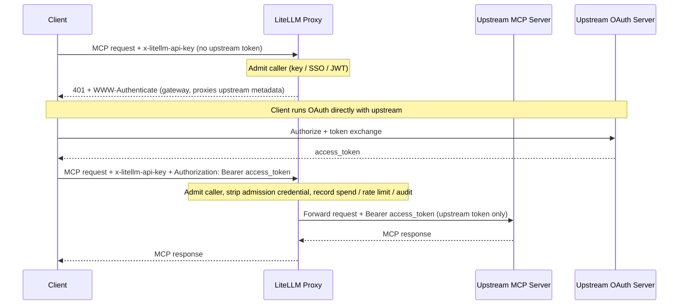
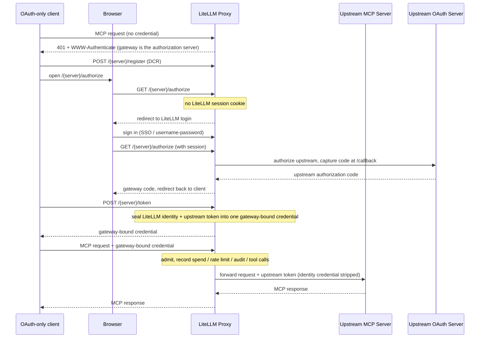
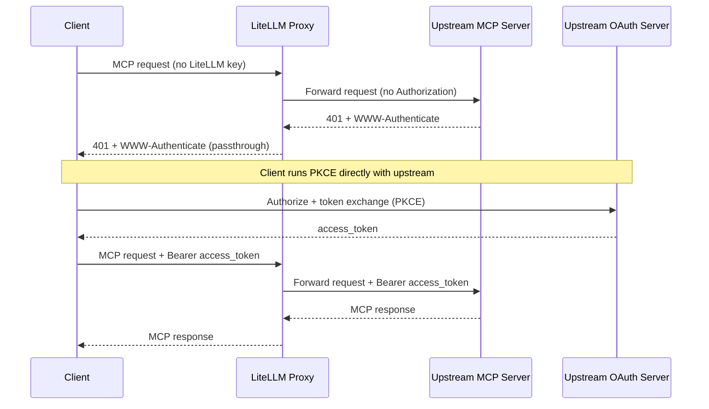

# MCP OAuth Passthrough

Some MCP servers run their own OAuth issuer and expect the client (Claude Code, Cursor, ChatGPT, etc.) to authenticate directly against it. For those servers LiteLLM can let the client's own upstream token flow through instead of minting, storing, or refreshing anything itself.

Two `auth_type` values cover this. They differ in one thing: whether LiteLLM still authenticates the caller at its own edge.

| Mode | LiteLLM admission | Credential forwarded upstream | Spend / rate limits / audit | Use when |
|------|-------------------|-------------------------------|-----------------------------|----------|
| `true_passthrough` | None; anonymous at the LiteLLM layer | The client's `Authorization`, verbatim | Not recorded | LiteLLM should add zero auth and the upstream is the sole gate |
| `oauth_delegate` | Required (LiteLLM key / SSO / JWT) | A distinct upstream bearer the caller sends alongside admission | Recorded, keyed on the admission identity | You want LiteLLM to keep gating and observing the route while the upstream owns tool authorization |

Both modes return the upstream's protected-resource metadata verbatim during discovery, so the client always authorizes against the real upstream issuer.

Both also take an orthogonal `dcr_bridge` flag that changes where an OAuth-only client discovers its authorization server. Turn it on for clients that cannot register with the upstream IdP themselves or cannot send two separate credentials, such as OpenCode, Claude Code, Cursor, and Claude Desktop. See [Gateway-hosted sign-in (DCR bridge)](#gateway-hosted-sign-in-dcr-bridge).

## true_passthrough

LiteLLM acts as a transparent proxy: no admission check, nothing minted or stored, and the client's `Authorization` forwarded unchanged. Reach for it when the upstream is the source of truth for access and you do not want LiteLLM gating the route twice.

### Setup

```yaml title="config.yaml" showLineNumbers
mcp_servers:
  notion_passthrough:
    url: "https://mcp.notion.com/mcp"
    auth_type: true_passthrough
```

That is the entire configuration. No client credentials or token endpoints, because LiteLLM never participates in the token exchange.

### How It Works

- The client sends its MCP request with no LiteLLM API key.
- With no upstream token yet, LiteLLM relays the upstream's own `401` and `WWW-Authenticate`.
- The client runs OAuth directly against the upstream issuer.
- The client retries with `Authorization: Bearer <upstream-token>`, and LiteLLM forwards it untouched.



### Fail-Closed Behavior

The transparent path fires only when every target resolves to `true_passthrough`. It falls back to normal LiteLLM admission when:

- The server's `auth_type` is anything else.
- The request targets multiple servers (`x-mcp-servers: a,b`) and any one is not `true_passthrough`.
- The target server cannot be resolved from the URL path or the `x-mcp-servers` header.

### Security Trade-offs

- The MCP route becomes an unauthenticated ingress at the LiteLLM layer.
- Spend tracking, per-key rate limits, and any guardrail depending on `user_api_key_auth.user_id` do not run.
- LiteLLM cannot tell who the caller is, so per-user auditing must come from the upstream server's logs.
- `available_on_public_internet: false` adds no authentication here; it mainly controls IP-based discovery ([see guide](./mcp_public_internet.md)).
- Only enable it on servers whose upstream OAuth issuer you trust to enforce access control.

### Config Reference

| Field | Required | Description |
|-------|----------|-------------|
| `auth_type` | Yes | Must be `true_passthrough`. |
| `url` | Yes | The upstream MCP server URL. |

## oauth_delegate

LiteLLM still admits the caller (LiteLLM API key, SSO, or JWT), then forwards a separate upstream bearer the caller supplies. LiteLLM mints nothing and never forwards the admission credential upstream. Use it when the upstream owns tool-level authorization but you still want LiteLLM gating the route and keeping spend, rate-limit, and audit attribution.

### Setup

```yaml title="config.yaml" showLineNumbers
mcp_servers:
  notion_delegate:
    url: "https://mcp.notion.com/mcp"
    auth_type: oauth_delegate
```

No client credentials, for the same reason as `true_passthrough`. What changes is the request: the caller sends two credentials.

### How It Works

- The caller admits with a LiteLLM credential in `x-litellm-api-key`.
- The upstream token rides in `Authorization` (or `x-mcp-<alias>-authorization` for aggregate requests).
- LiteLLM validates admission, then forwards only the upstream bearer, never the admission credential.
- With no upstream token yet, LiteLLM returns a `401` pointing at the gateway's `oauth-protected-resource` well-known, which proxies the upstream metadata verbatim.



:::warning Keep the two credentials in separate headers

If a caller sends a single credential in `Authorization` with no `x-litellm-api-key`, LiteLLM treats it as the admission credential (virtual key, IdP JWT, or SSO session token) and never forwards it upstream. That is the leak defense keeping a LiteLLM or IdP token from reaching a third-party MCP server.

:::

### Security Trade-offs

- Admission always runs, so there is no anonymous ingress.
- Spend, rate limits, and audit resolve against the admission identity.
- LiteLLM forwards the upstream token without inspecting it, so the upstream still owns tool-level authorization and token validation.

### Config Reference

| Field | Required | Description |
|-------|----------|-------------|
| `auth_type` | Yes | Must be `oauth_delegate`. |
| `url` | Yes | The upstream MCP server URL. |

At request time: admission in `x-litellm-api-key`, upstream token in `Authorization: Bearer <upstream-token>` (or `x-mcp-<alias>-authorization` for a specific server in an aggregate request).

## Gateway-hosted sign-in (DCR bridge) {#gateway-hosted-sign-in-dcr-bridge}

OAuth-only MCP clients (OpenCode, Claude Code, Cursor, Claude Desktop) connect by running a single Dynamic Client Registration (RFC 7591) plus PKCE flow against whatever authorization server the discovery metadata advertises. They:

- Hold no client credential pre-provisioned with the upstream IdP.
- Cannot send a separate LiteLLM credential alongside an upstream token.

So neither the plain `true_passthrough` request nor the two-header `oauth_delegate` request fits them. The `dcr_bridge` flag closes that gap:

- **On:** LiteLLM advertises itself as the authorization server during discovery and hosts `/{server_name}/register`, `/{server_name}/authorize`, and `/{server_name}/token`. The client registers and signs in through the gateway while LiteLLM runs the upstream OAuth behind those endpoints.
- **Off:** LiteLLM relays the upstream server's own OAuth metadata verbatim. Suits clients already registered with the upstream IdP, or able to run DCR directly against it.

Where to set it:

- Valid only on `true_passthrough` and `oauth_delegate`; rejected on any other `auth_type` at create, update, and config load.
- In the Admin UI it is the "Gateway-hosted sign-in (DCR bridge)" switch on the MCP server form, defaulted on for those two modes.
- In config it is a boolean field.

### true_passthrough with the bridge

```yaml title="config.yaml" showLineNumbers
mcp_servers:
  miro:
    url: "https://mcp.miro.com/"
    transport: http
    auth_type: true_passthrough
    dcr_bridge: true
```

The transparent option for OAuth-only clients:

- The client discovers the gateway as its authorization server and registers through `POST /{server_name}/register`.
- It runs PKCE against `GET /{server_name}/authorize` and `POST /{server_name}/token`.
- Where the upstream supports DCR, LiteLLM relays the client's registration to it.
- Where the server has no stored `client_id`, LiteLLM mints an ephemeral client for the flow and persists nothing.
- No LiteLLM sign-in is involved, and no caller identity or spend is recorded.

### oauth_delegate with the bridge

```yaml title="config.yaml" showLineNumbers
mcp_servers:
  miro:
    url: "https://mcp.miro.com/"
    transport: http
    auth_type: oauth_delegate
    dcr_bridge: true
```

This combination keeps LiteLLM in the observability path for OAuth-only clients, so spend, rate limits, audit, and per-tool-call attribution all resolve. Reach for it when you want to see in LiteLLM which server a caller used and which tools it invoked.

An OAuth-only client cannot present a LiteLLM key inline, so identity comes from a LiteLLM browser session instead:

- At the authorize step LiteLLM looks for a LiteLLM UI session cookie.
- With no cookie, it redirects to LiteLLM login (`/sso/key/generate`) first.
- After sign-in the user re-initiates the connection.
- LiteLLM seals that identity plus the upstream token into a gateway-bound credential.
- The client stores that credential and replays it on every later request; admission, spend, and audit resolve against it.

:::warning Two prerequisites

- **The gateway needs a working browser sign-in** (SSO or username/password). Without one there is no identity to bind and the authorize step cannot proceed. A missing gateway sign-in is the usual reason an `oauth_delegate` bridge connection stalls at the login page.
- **The client's OAuth flow must run in an interactive browser session.** OpenCode, Claude Code, Cursor, and Claude Desktop all do.

For fully scripted, non-interactive delegation, leave `dcr_bridge` off and use the two-header `oauth_delegate` request instead.

:::



### Choosing the flag

| Situation | `dcr_bridge` |
|-----------|--------------|
| An OAuth-only client (OpenCode, Claude Code, Cursor, Claude Desktop, ChatGPT) that holds no upstream `client_id` and cannot send two credentials | `true` |
| A client already registered with the upstream IdP, or one that runs DCR directly against the upstream | `false` |
| A scripted, non-interactive caller that can send `x-litellm-api-key` plus an upstream `Authorization` bearer | `false`, with `auth_type: oauth_delegate` (two-header form) |

### Connecting a client

- Point the client at `https://<gateway-host>/<server_name>/mcp` and let it discover OAuth from there.
- Do not configure a `client_id` or secret on the client; the gateway handles registration and the token exchange.
- On a `true_passthrough` bridge server the browser flow authorizes only with the upstream.
- On an `oauth_delegate` bridge server it signs in to LiteLLM first, then authorizes with the upstream.

Follow each client's own MCP documentation for exact field names, which change over time.

Claude Code registers and runs the browser flow on first use:

```bash
claude mcp add --transport http miro https://<gateway-host>/miro/mcp
```

Cursor reads remote MCP servers from `~/.cursor/mcp.json`:

```json
{
  "mcpServers": {
    "miro": {
      "url": "https://<gateway-host>/miro/mcp"
    }
  }
}
```

OpenCode reads them from `opencode.json`:

```json
{
  "mcp": {
    "miro": {
      "type": "remote",
      "url": "https://<gateway-host>/miro/mcp",
      "enabled": true
    }
  }
}
```

### Config Reference

| Field | Required | Description |
|-------|----------|-------------|
| `auth_type` | Yes | Must be `true_passthrough` or `oauth_delegate`; `dcr_bridge` is rejected on any other value. |
| `url` | Yes | The upstream MCP server URL. |
| `dcr_bridge` | Yes | `true` so the gateway hosts sign-in for OAuth-only clients. Off relays the upstream's own OAuth metadata instead. |

## Delegate Auth to Upstream (PKCE Passthrough) {#delegate-auth-to-upstream-pkce-passthrough}

:::warning Deprecated

`delegate_auth_to_upstream` is the original flag-based form of transparent passthrough and is planned for deprecation. It is the direct predecessor of `auth_type: true_passthrough` and behaves the same way (same how-it-works, same fail-closed behavior, same security trade-offs), so new servers should use `true_passthrough`. The section below is kept for existing configs.

:::

For OAuth2 MCP servers where the client already authenticates directly against the upstream server's own OAuth issuer, you can opt the route into **upstream-delegated auth**: LiteLLM stops checking its own API key / SSO and lets the client's PKCE flow run end-to-end with the upstream MCP server.

### Setup

```yaml title="config.yaml" showLineNumbers
mcp_servers:
  notion_mcp:
    url: "https://mcp.notion.com/mcp"
    auth_type: oauth2
    oauth2_flow: authorization_code
    delegate_auth_to_upstream: true
```

Delegated servers are interactive, so they take `oauth2_flow: authorization_code`. The flag is honored **only** when `auth_type: oauth2`; setting it on any other auth type is silently ignored.

:::warning Internal-only (`available_on_public_internet: false`) **and** upstream PKCE delegation

Using **`available_on_public_internet: false`** together with **`delegate_auth_to_upstream: true`** on an **`auth_type: oauth2`** interactive server (not `oauth2_flow: client_credentials`) still allows **anonymous** callers to reach the upstream OAuth2 **`/authorize`** flow and complete PKCE for matching MCP routes **without a LiteLLM API key session**. The internal-only flag mainly controls IP-based discovery and related behavior ([see guide](./mcp_public_internet.md)); it does **not** disable this delegate bypass.

**What to do:** Enforce access at the upstream IdP and network edge. The LiteLLM UI surfaces a warning when both settings are enabled; the proxy logs a warning when the server is loaded from config or the database.

:::

### How It Works

1. Client sends an MCP request to LiteLLM with no `x-litellm-api-key` (and optionally no `Authorization` header).
2. LiteLLM detects that every target server in the request is `auth_type: oauth2` AND has `delegate_auth_to_upstream: true`, and skips its own API-key/SSO check.
3. LiteLLM also skips its pre-emptive 401, so the upstream MCP server's own `401` + `WWW-Authenticate` flows back to the client.
4. The client completes PKCE directly with the upstream OAuth issuer.
5. The client retries with `Authorization: Bearer <upstream-token>`. LiteLLM forwards it untouched.



### Fail-Closed Behavior

The bypass fires only when **every** target opts in. It fails closed and runs normal LiteLLM auth when:

- The server's `auth_type` is anything other than `oauth2`.
- `delegate_auth_to_upstream` is not explicitly `true`.
- The request targets multiple servers (`x-mcp-servers: a,b`) and any one is not delegated.
- The target server cannot be resolved from the URL path or `x-mcp-servers` header.

### Security Trade-offs

- The MCP route becomes an **unauthenticated** ingress at the LiteLLM layer. Spend tracking, per-key rate limits, and guardrails depending on `user_api_key_auth.user_id` do not run.
- LiteLLM cannot tell who the caller is by design, so per-user auditing must come from the upstream MCP server's own logs.
- Only enable this on servers whose upstream OAuth issuer you trust to enforce access control.

### Config Reference

| Field | Required | Description |
|-------|----------|-------------|
| `auth_type` | Yes | Must be `oauth2`. The flag is ignored otherwise. |
| `oauth2_flow` | Yes | Set to `authorization_code`; delegation passes the client's interactive PKCE flow through to the upstream server. |
| `delegate_auth_to_upstream` | Yes | Set to `true` to opt this server into PKCE passthrough. |
